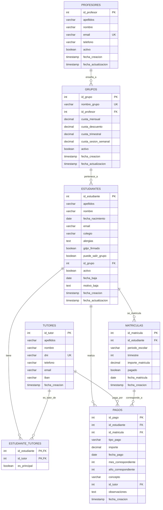

# 📚 Five a Day eVolution - Sistema de Gestión Académica

---

## 📌 Estado del Proyecto

URL: five-a-day.netlify.app
Documentacion: ...
Estado: 🟢
Version actual: **v0.1**

| Última mejora | Fecha último commit | Próxima feature planificada |
|--------------|---------------------|-----------------------------|
| Sistema de notificaciones mejorado | 2025-08-09 | Integración de Celery + Redis |

---

## ✅ Checklist de Desarrollo

🔶 Versión Alfa (8-10 semanas | 160-200h)

- [ ] Análisis de Google Sheets existentes
- [ ] Diseño de base de datos relacional (ER + normalización)
- [ ] Configuración inicial del proyecto (Poetry + Django + Git)
- [ ] Modelos principales en Django
- [ ] Django Admin personalizado
- [ ] Lógica contable básica (tracking de pagos, informes)
- [ ] Vistas básicas y templates mínimos
- [ ] Scripts de migración de datos
- [ ] Testing manual y ajustes

🔷 Versión Beta (5-6 semanas | 100-120h)

- [ ] Dockerización + PostgreSQL
- [ ] Mejora del frontend (templates y UX)
- [ ] Integración con Google Sheets
- [ ] Integración básica con Gmail
- [ ] Primera automatización (recordatorio de pago)
- [ ] Despliegue inicial en servidor

🟢 Versión 1.0 (6-7 semanas | 120-140h)

- [ ] Frontend definitivo (dashboard mejorado, formularios AJAX)
- [ ] Exportación automática a Google Sheets
- [ ] Gestión de documentos PDF (facturas, certificados)
- [ ] Sistema de notificaciones mejorado
- [ ] Optimización de queries y rendimiento
- [ ] Documentación y manual de usuario
- [ ] Correcciones post-lanzamiento

🟣 Versión 2.0 (7-8 semanas | 140-160h)

### 🟣 Versión 2.0 (7-8 semanas | 140-160h)
- [ ] Celery + Redis (tareas programadas)
- [ ] Automatizaciones avanzadas y reportes periódicos
- [ ] Integración SMS con Twilio
- [ ] Pasarela de pagos con Stripe
- [ ] Sistema multiusuario con permisos
- [ ] Auditoría y logs históricos
- [ ] Seguridad reforzada (2FA, rate limiting)
- [ ] Testing de carga y optimización final

## 📑 Índice

1. [Descripción General](#-descripción-general)
2. [Objetivos del Proyecto](#-objetivos-del-proyecto)
3. [Características Principales](#-características-principales)
4. [Planificación y Roadmap](#-planificación-y-roadmap)
5. [Arquitectura y Tecnologías](#-arquitectura-y-tecnologías)
6. [Esquema de Base de Datos (ER)](#-esquema-de-base-de-datos-er)
7. [Interfaz de Usuario (UI)](#-interfaz-de-usuario-ui)
8. [Instalación y Configuración](#-instalación-y-configuración)
    - [Instalación con Docker](#instalación-con-docker)
    - [Instalación manual (opcional)](#instalación-manual-opcional)
9. [Guía de Uso](#-guía-de-uso)
10. [Pruebas y Calidad](#-pruebas-y-calidad)
11. [Despliegue en Producción](#-despliegue-en-producción)
12. [Integraciones Externas](#-integraciones-externas)
13. [Futuras Mejoras](#-futuras-mejoras)
14. [Licencia](#-licencia)

---

## 📄 Descripción General

Este proyecto es una solución integral para la **gestión académica** que cubre:

- Administración de alumnos, padres/tutores y profesores.
- Control de pagos, facturación y gastos.
- Automatización de recordatorios y notificaciones.
- Exportación de datos a Google Sheets y generación de documentos PDF.
- Integración con servicios externos como Gmail, Stripe y Twilio.
- Sistema de permisos y auditoría para entornos multiusuario.

**Duración estimada de desarrollo:** 26-30 semanas (520-600 horas).  
**Metodología:** Desarrollo incremental con entregas Alfa, Beta, v1.0 y v2.0.

---

## 🎯 Objetivos del Proyecto

- Reducir la carga administrativa mediante automatización.
- Centralizar la información académica y financiera en un solo sistema.
- Facilitar el acceso y la interacción para usuarios no técnicos.
- Garantizar la seguridad y la integridad de la información.

---

## 🚀 Características Principales

### 🔶 Versión Alfa
- Análisis y diseño de base de datos.
- Implementación de modelos principales en Django.
- Django Admin personalizado.
- Lógica contable básica.
- Migración inicial de datos.
- Dashboard básico.

### 🔷 Versión Beta
- Dockerización y PostgreSQL.
- Mejora del frontend (templates y UX).
- Integración con Google Sheets y Gmail.
- Primeras automatizaciones.
- Despliegue inicial.

### 🟢 Versión 1.0
- Rediseño completo de la UI.
- Exportación automática a Google Sheets.
- Generación de facturas y certificados en PDF.
- Notificaciones avanzadas.
- Optimización y documentación de usuario.

### 🟣 Versión 2.0
- Celery + Redis para tareas programadas.
- Automatizaciones avanzadas y reportes periódicos.
- SMS con Twilio.
- Pasarela de pagos con Stripe.
- Sistema multiusuario con permisos.
- Auditoría y mejoras de seguridad.

---

## 🗓 Planificación y Roadmap

---

## 🛠 Arquitectura y Tecnologías

- **Backend:** Django (Python)
- **Base de datos:** PostgreSQL
- **Contenedores:** Docker + docker-compose
- **Frontend:** Templates Django (Bootstrap + CSS personalizado)
- **Servicios externos:** Google Sheets API, Gmail API, Twilio, Stripe
- **Automatización:** Celery + Redis
- **Servidor de producción:** Nginx + Gunicorn

---

## 🗃 Esquema de Base de Datos (ER)

## 📥 Instalación y Configuración

### Instalación con Docker

1. Clonar el repositorio:

git clone https://github.com/usuario/sistema-gestion-academica.git
cd sistema-gestion-academica

2. Configurar variables de entorno:

Copia el archivo .env.example a .env.
Completa la información de base de datos, API Keys y credenciales.

3. Levantar contenedores:

docker-compose up --build

4. Aplicar migraciones:

docker-compose exec web python manage.py migrate

5. Crear usuario administrador:

docker-compose exec web python manage.py createsuperuser

6. Acceder a la aplicación:

URL: http://localhost:8000
Admin: http://localhost:8000/admin

---

### Instalación manual (opcional)

Crear entorno virtual e instalar dependencias con Poetry.
Configurar PostgreSQL y el archivo .env.
Ejecutar migraciones y crear usuario administrador.
Lanzar el servidor con python manage.py runserver.

## 🖥 Interfaz de Usuario (UI)

## 📘 Guía de Uso

Inicio de sesión: Accede con tu usuario y contraseña.
Navegación: Menú principal para acceder a módulos de gestión.
Búsquedas y filtros: Herramientas integradas para encontrar registros rápidamente.
Exportación de datos: Opción de exportar a Google Sheets desde el panel de administración.
Generación de documentos: Descargar facturas y certificados en PDF.

## 🧪 Pruebas y Calidad

Actualmente no hay un sistema de tests automatizados, pero está previsto incluir:
Pruebas unitarias de modelos y vistas.
Pruebas de integración para APIs externas.
Pruebas de carga y estrés (especialmente para Celery + Redis).

## 🔗 Integraciones Externas

Google Sheets API: Exportación y sincronización de datos.
Gmail API: Envío de correos electrónicos personalizados.
Twilio: Envío de notificaciones SMS.
Stripe: Pagos online y conciliación automática.

##  Despliegue en Producción

Configurar servidor con Nginx + Gunicorn.
Instalar Docker y docker-compose.
Configurar backups automáticos de base de datos.
Configurar SSL/HTTPS.
Activar tareas programadas con Celery Beat.

# Experimental - Aun estoy viendo como funciona esto

<!-- AUTO-SECTION:VERSION -->

| Versión actual | Última mejora | Fecha último commit | Próxima feature planificada |
|----------------|--------------|---------------------|-----------------------------|
| **vX.Y.Z** | *Texto de última mejora* | YYYY-MM-DD | *Siguiente feature* |
<!-- /AUTO-SECTION:VERSION -->

---

<!-- AUTO-SECTION:DEPENDENCIAS -->
## 📦 Dependencias

| Paquete | Versión |
|---------|---------|
| django  | 5.0.3   |
| psycopg2| 2.9.9   |
| celery  | 5.3.6   |
| redis   | 5.0.1   |
<!-- /AUTO-SECTION:DEPENDENCIAS -->
