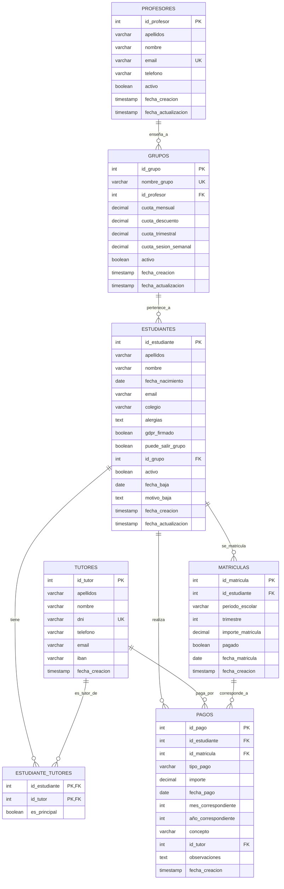

# 📚 Five a Day eVolution - Sistema de Gestión Académica

[](#)
[](#)
[](#)


---
<br></br>

## 🎓 Descripción General

*Sistema desarrollado con ❤️ para la gestión integral de centros educativos*

Five a Day eVolution es un sistema completo de gestión académica para la administración integral de una academia.

Servicios:

- Administración de alumnos, padres/tutores y profesores.
- Control de pagos, facturación y gastos.
- Automatización de recordatorios, notificaciones, emails y documentación.
- Soporte para administradores y profesores.

## 🎯 Objetivos del Proyecto

- Reducir la carga administrativa mediante automatización.
- Centralizar la información académica y financiera en un solo sistema.
- Garantizar la seguridad y la integridad de la información.

## 🚩 Estado del Proyecto

URL: [Five a Day eVolution](https://five-a-day.netlify.app)

Documentacion: ...

Estado: 🟢

Version actual: **v0.1**

| Última mejora | Fecha último commit | Próxima feature planificada |
|--------------|---------------------|-----------------------------|
| Setup completo del proyecto | 2025-08-09 | Modelos |

## ✅ Roadmap de Desarrollo

<details>
<summary>🔶 Versión Alfa (8-10 semanas | 160-200h)</summary>

- [X] Análisis de Google Sheets existentes
- [X] Diseño de base de datos relacional (ER + normalización)
- [X] Configuración inicial del proyecto (Poetry + Django + Git)
- [ ] Modelos principales en Django
- [ ] Django Admin personalizado
- [ ] Lógica contable básica (tracking de pagos, informes)
- [ ] Vistas básicas y templates mínimos
- [ ] Scripts de migración de datos
- [ ] Testing manual y ajustes

</details>

<details>
<summary>🔷 Versión Beta (5-6 semanas | 100-120h)</summary>

- [ ] Dockerización + PostgreSQL
- [ ] Mejora del frontend (templates y UX)
- [ ] Integración con Google Sheets
- [ ] Integración básica con Gmail
- [ ] Primera automatización (recordatorio de pago)
- [ ] Despliegue inicial en servidor

</details>

<details>
<summary>🟢 Versión 1.0 (6-7 semanas | 120-140h)</summary>

- [ ] Frontend definitivo (dashboard mejorado, formularios AJAX)
- [ ] Exportación automática a Google Sheets
- [ ] Gestión de documentos PDF (facturas, certificados)
- [ ] Sistema de notificaciones mejorado
- [ ] Optimización de queries y rendimiento
- [ ] Documentación y manual de usuario
- [ ] Correcciones post-lanzamiento

</details>

<details>
<summary>🟣 Versión 2.0 (7-8 semanas | 140-160h)</summary>

### 🟣 Versión 2.0 (7-8 semanas | 140-160h)
- [ ] Celery + Redis (tareas programadas)
- [ ] Automatizaciones avanzadas y reportes periódicos
- [ ] Integración SMS con Twilio
- [ ] Pasarela de pagos con Stripe
- [ ] Sistema multiusuario con permisos
- [ ] Auditoría y logs históricos
- [ ] Seguridad reforzada (2FA, rate limiting)
- [ ] Testing de carga y optimización final

</details>

## 📋 Índice

1. [Características Principales](#-características-principales)
2. [Planificación y Diagrama de Gantt](#-planificación-y-diagrama-de-gantt)
3. [Arquitectura y Tecnologías](#-arquitectura-y-tecnologías)
4. [Esquema de Base de Datos](#-esquema-de-base-de-datos)
5. [Interfaz de Usuario (UI)](#-interfaz-de-usuario-ui)
6. [Desarrollo](#-desarrollo)
    - [Instalación con Docker](#instalación-con-docker)
    - [Instalación manual](#instalación-manual)
    - [Archivo .env](#archivo-env)
7. [Dependencias](#-dependencias)
8. [Guía de Uso](#-guía-de-uso)
9. [Pruebas y Calidad](#-pruebas-y-calidad)
10. [Despliegue en Producción](#despliegue-en-producción)
11. [Integraciones Externas](#-integraciones-externas)
12. [Futuras Mejoras](#futuras-mejoras)
13. [Licencia](#licencia)
14. [Contribuir](#contribuir)

---

## 📅 Características Principales

### 🔶 Versión Alfa - 22 Agosto
- Análisis y diseño de base de datos.
- Implementación de modelos principales en Django.
- Django Admin personalizado.
- Lógica contable básica.
- Migración inicial de datos.
- Dashboard básico.

### 🔷 Versión Beta - 4 Octubre
- Dockerización y PostgreSQL.
- Mejora del frontend (templates y UX).
- Integración con Google Sheets y Gmail.
- Primeras automatizaciones.
- Despliegue inicial.

### 🟢 Versión 1.0 - 25 Diciembre
- Rediseño completo de la UI.
- Exportación automática a Google Sheets.
- Generación de facturas y certificados en PDF.
- Notificaciones avanzadas.
- Optimización y documentación de usuario.

### 🟣 Versión 2.0
- Celery + Redis para tareas programadas.
- Automatizaciones avanzadas y reportes periódicos.
- SMS con Twilio.
- Pasarela de pagos con Stripe.
- Sistema multiusuario con permisos.
- Auditoría y mejoras de seguridad.

## 📈 Planificación y Diagrama de Gantt


## 🛠 Arquitectura y Tecnologías

- **Backend:** Django (Python)
- **Base de datos:** PostgreSQL
- **Contenedores:** Docker
- **Cloud:** Google Cloud Platform
- **Frontend:** Templates Django (Bootstrap CSS + Javascript)
- **Servicios externos:** Google Sheets API, Gmail API, Twilio, Stripe
- **Automatización:** Celery + Redis
- **Servidor de producción:** Nginx + Gunicorn

## 🔗 Esquema de Base de Datos

<details>
<summary>Esquema ER</summary>



</details>

## 💻 Desarrollo

### Instalación con Docker

<details>
<summary>Docker</summary>
    
1. Clonar el repositorio:

```bash
git clone https://github.com/starseeker-code/five-a-day.git
cd five-a-day
```

2. Configurar variables de entorno:

Copia el archivo .env.example a .env.
Completa la información de base de datos, API Keys y credenciales.

3. Levantar contenedores:

```bash
docker-compose up --build
```

4. Aplicar migraciones:

```bash
docker-compose exec web python manage.py migrate
```

5. Acceder a la aplicación en local:

```bash
URL: http://localhost:8000
```

</details>

### Instalación manual

<details>
<summary>Poetry</summary>

1. Clonar el repositorio:

```bash
git clone https://github.com/starseeker-code/five-a-day.git
cd five-a-day
```

2. Configurar variables de entorno:

Copia el archivo .env.example a .env.
Completa la información de base de datos, API Keys y credenciales.

3. Crear entorno virtual:

```bash
poetry install
```

4. Acceder al entorno virtual:

```bash
poetry shell
```

5. Ejecutar migraciones y lanzar servidor:

```bash
cd project && python manage.py migrate && python manage.py runserver
```

</details>

### Archivo .env

<details>
<summary>Archivo <code>.env</code> en <code>/project/.env</code></summary>

```ini
# Django
SECRET_KEY=tu_secret_key_django_muy_seguro
DEBUG=False
ALLOWED_HOSTS=localhost,127.0.0.1,tu-dominio.com

# Base de datos
DB_NAME=sga_db
DB_USER=sga_user
DB_PASSWORD=tu_password_seguro
DB_HOST=db
DB_PORT=5432

# Email
EMAIL_HOST=smtp.gmail.com
EMAIL_PORT=587
EMAIL_USE_TLS=True
EMAIL_HOST_USER=tu-email@gmail.com
EMAIL_HOST_PASSWORD=tu_app_password
```

</details>


## 📦 Dependencias

<!-- AUTO-SECTION:DEPENDENCIAS -->

| Paquete | Versión |
|---------|---------|
| django  | 5.0.3   |
| psycopg2| 2.9.9   |
| celery  | 5.3.6   |
| redis   | 5.0.1   |

<!-- /AUTO-SECTION:DEPENDENCIAS -->

## 📖 Guía de Uso


## 🧪 Pruebas y Calidad

Actualmente no hay un sistema de tests automatizados, pero está previsto incluir:
Pruebas unitarias de modelos y vistas.
Pruebas de integración para APIs externas.
Pruebas de carga y estrés (especialmente para Celery + Redis).

## 🌍 Integraciones Externas

Google Sheets API: Exportación y sincronización de datos.
Gmail API: Envío de correos electrónicos personalizados.
Twilio: Envío de notificaciones SMS.
Stripe: Pagos online y conciliación automática.

## 🚀 Despliegue en Producción

Configurar servidor con Nginx + Gunicorn.
Instalar Docker y docker-compose.
Configurar backups automáticos de base de datos.
Configurar SSL/HTTPS.
Activar tareas programadas con Celery Beat.

## Futuras mejoras

WIP

## Licencia

WIP

## Contribuir

WIP

---

# Experimental - Aun estoy viendo como funciona esto

<!-- AUTO-SECTION:VERSION -->
[](#)
[](#)
[](#)

| Versión actual | Última mejora | Fecha último commit | Próxima feature planificada |
|----------------|--------------|---------------------|-----------------------------|
| **vX.Y.Z** | *Texto de última mejora* | YYYY-MM-DD | *Siguiente feature* |
<!-- /AUTO-SECTION:VERSION -->

<!-- AUTO-SECTION:DEPENDENCIAS -->
## 📦 Dependencias

| Paquete | Versión |
|---------|---------|
| django  | 5.0.3   |
| psycopg2| 2.9.9   |
| celery  | 5.3.6   |
| redis   | 5.0.1   |
<!-- /AUTO-SECTION:DEPENDENCIAS -->
