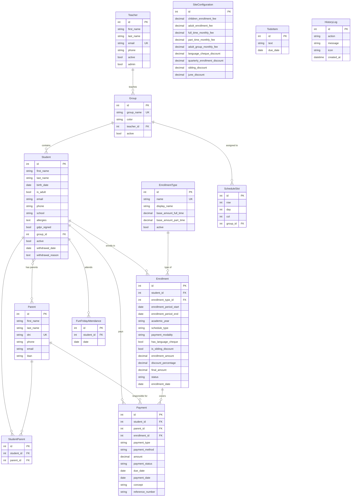
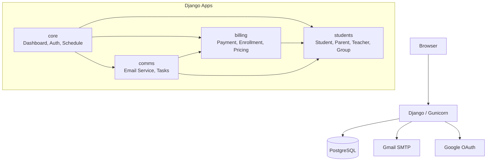
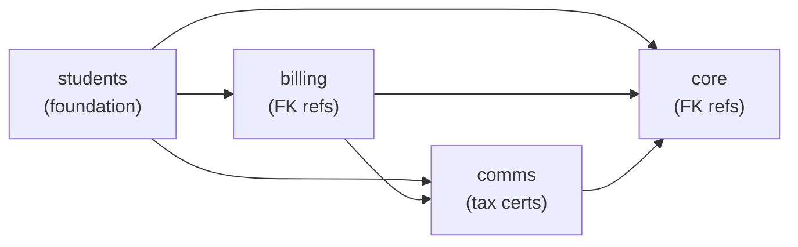

# Five a Day eVolution

<p align="center">
  
</p>

**Student management system for Five a Day English Academy** — a small English language school in Albacete, Spain. Built to centralize student records, automate billing, and streamline email communications for a team of 3-10 admins managing up to 2,000 students.

### Objectives

- Replace manual spreadsheets with a centralized, searchable database
- Automate monthly/quarterly payment generation and tracking
- Streamline parent communication with templated emails (12 types)
- Provide a dashboard for daily operations (pending payments, birthdays, tasks)
- Support the academic year cycle (September-June) with proper enrollment management

### Project Status

| | |
|---|---|
| **URL** | [Production deployment on GCP](https://five-a-day.netlify.app) |
| **Documentation** | This README + [DEPLOYMENT.md](DEPLOYMENT.md) + per-app READMEs |
| **Status** | Pre-production |
| **Version** | v1.0.0 (development) |

#### Changelog

| Version | Date | Description |
|---------|------|-------------|
| v1.0.0 | 2026-04-09 | Multi-app architecture, service layer, 112 tests, frontend cleanup |
| v0.30.2 | 2025-03-14 | History system, GDPR for adults, Docker compose workflow |
| v0.29.0 | 2025-03-01 | Enrollment system with discounts, adult students, email automation |

---

## Table of Contents

1. [Version History & Roadmap](#1-version-history--roadmap)
2. [Tech Stack](#2-tech-stack)
3. [Database Schema](#3-database-schema)
4. [Development & Docker](#4-development--docker)
5. [Project Structure & Architecture](#5-project-structure--architecture)
6. [Features by View](#6-features-by-view)
7. [Testing](#7-testing)
8. [Migrations](#8-migrations)
9. [Contributing](#9-contributing)
10. [License](#10-license)

---

## 1. Version History & Roadmap

<details>
<summary><strong>v1.0.0 — Architecture Refactor & Test Suite (current)</strong></summary>

**Architecture**
- Split monolithic `core` app into 4 apps: `students`, `billing`, `comms`, `core`
- Created service layer: EnrollmentService, PaymentService, PricingService
- Split 3,648-line views.py into 12 focused modules
- Fixed module-level querysets, wildcard imports, dual pricing source of truth

**Frontend**
- Replaced 1,178-line pre-compiled Tailwind with CDN + custom violet palette config
- Extracted ~1,400 lines of inline JS into 13 static modules
- Removed `#webcrumbs` CSS scoping wrapper
- base.html: 610 lines reduced to 305 lines

**Testing**
- 112 pytest tests: 34 model, 24 service, 54 view tests
- Test settings with SQLite (no Docker needed)
- Found and fixed Payment `active` field bug

**Documentation**
- Comprehensive README with 10 sections
- Per-app README.md files (core, students, billing, comms)
- CLAUDE.md for AI-assisted development
- DEPLOYMENT.md for Google Cloud Platform

</details>

<details>
<summary><strong>v0.30.2 — Docker & History System</strong></summary>

- Docker Compose with PostgreSQL 16 + Django
- Makefile with 40+ commands for development workflow
- HistoryLog system for tracking user actions (capped at 1,000 entries)
- GDPR tracking for adult students
- Improved entrypoint script for Docker

</details>

<details>
<summary><strong>v0.29.0 — Enrollment & Email System</strong></summary>

- Enrollment system with 3 plans (monthly full/part-time, quarterly)
- Discount engine: language cheque, sibling, quarterly, June end-of-year
- Adult student support with separate pricing
- 12 email templates with preview and test-send
- Fun Friday attendance tracking
- Support ticket system

</details>

### Roadmap

<details>
<summary><strong>v1.1 — Waiting List & Group Capacity</strong></summary>

**Waiting list system**: Students can be created with a `waiting_list` flag instead of being immediately enrolled. When a group has capacity (a student leaves or withdraws), waiting list students are surfaced for assignment.

- New `is_waiting` boolean on Student model
- `max_students` soft limit on Group model with `student_count` tracking
- Notification when a student is deactivated and a group drops below capacity
- Waiting list management view: filter by group preference, priority by creation date
- Quick-assign flow: from waiting list or student creation, assign to group with one click
- Dashboard widget showing groups with available spots and waiting students count

</details>

<details>
<summary><strong>v1.2 — Google Sheets Integration</strong></summary>

Automatic export of student/payment data to Google Sheets for the school's existing spreadsheet workflows. Read and write via `gspread` using the already-configured Google OAuth credentials.

</details>

<details>
<summary><strong>v1.3 — PDF Invoice Generation</strong></summary>

Proper PDF generation using WeasyPrint. Invoice/receipt PDFs for individual payments and quarterly summaries, downloadable from the payment detail page. Replace the current HTML-fallback tax certificate.

</details>

<details>
<summary><strong>v1.4 — Celery + Redis Deployment</strong></summary>

Full async task processing with Redis broker. Move all email sends to background tasks. Celery Beat for scheduled jobs: daily birthday emails, monthly payment generation, monthly reports.

</details>

<details>
<summary><strong>v1.5 — Expense Tracking</strong></summary>

Track academy expenses (rent, supplies, salaries) with categories, recurring templates, and monthly totals. Income-vs-expense dashboard widget.

</details>

<details>
<summary><strong>v1.6 — Multi-User Permissions</strong></summary>

Replace SimpleAuthMiddleware with Django's auth system. Roles: admin (full), teacher (read-only students + schedule), assistant (everything except config).

</details>

<details>
<summary><strong>v1.7 — Parent Portal</strong></summary>

Read-only web portal for parents to view enrollment status, payment history, upcoming events, and download receipts/certificates.

</details>

<details>
<summary><strong>v2.0 — Stripe Payments</strong></summary>

Online payment via Stripe. Parents receive payment links by email. Automatic reconciliation with pending payments.

</details>

---

## 2. Tech Stack

### Backend

| Technology | Version | Purpose |
|-----------|---------|---------|
| Python | 3.12+ | Runtime |
| Django | 5.2.5 | Web framework |
| PostgreSQL | 16 (Alpine) | Production database |
| SQLite | 3 | Development/test database |
| Celery | 5.5.3 | Async task queue (eager mode without Redis) |
| Gunicorn | 21.2.0 | Production WSGI server |
| WhiteNoise | 6.11.0 | Static file serving in production |
| Poetry | - | Dependency management |

### Frontend

| Technology | Purpose |
|-----------|---------|
| Tailwind CSS (CDN) | Utility-first CSS framework with custom violet primary palette |
| Material Symbols Outlined | Icon system (Google Fonts CDN) |
| Vanilla JavaScript | 13 static JS modules, zero build tools |
| Trebuchet MS | Primary font |
| Montserrat Alternates + Parisienne | Login/error page fonts (Google Fonts) |

### Infrastructure

| Technology | Purpose |
|-----------|---------|
| Docker | Containerization (multi-stage build, non-root user) |
| Docker Compose | Service orchestration (PostgreSQL + Django) |
| Google Cloud Platform | Production hosting (Cloud Run + Cloud SQL) |
| Gmail SMTP | Email sending (app password) |
| Google OAuth 2.0 | Admin authentication (optional) |

### Python Packages

| Package | Purpose |
|---------|---------|
| `djangorestframework` | Installed but not actively used (future API) |
| `django-cors-headers` | CORS handling for future API consumers |
| `django-filter` | Query filtering utilities |
| `django-extensions` | Development utilities (shell_plus, etc.) |
| `django-gsheets` | Google Sheets integration (future) |
| `gspread` | Google Sheets API client |
| `pandas` | Data processing for exports |
| `openpyxl` | Excel file generation |
| `httpx` | HTTP client |
| `psycopg2-binary` | PostgreSQL adapter |
| `dj-database-url` | Database URL parsing (Cloud deployments) |
| `python-dotenv` | .env file loading |
| `pytest` + `pytest-django` | Testing framework |

---

## 3. Database Schema



### Key Constraints

- **SiteConfiguration**: Singleton (pk=1), cannot be deleted
- **Enrollment**: UniqueConstraint — only one active enrollment per student
- **Student-Parent**: Unique together (student, parent)
- **FunFridayAttendance**: Unique together (student, date)
- **ScheduleSlot**: Unique together (row, day, col)

---

## 4. Development & Docker

### Quick Start

```bash
# Clone and configure
git clone <repo-url>
cd five-a-day
cp .env.example .env   # Edit with your values

# Docker (recommended)
make build
make up                # http://localhost:8000

# Local (no Docker)
poetry install
cd project
python manage.py migrate
python manage.py runserver
```

### Make Commands

| Command | Description |
|---------|-------------|
| **Setup** | |
| `make setup` | Copy .env.example to .env |
| `make build` | Build Docker images |
| `make rebuild` | Full rebuild (no cache) + start |
| **Lifecycle** | |
| `make up` | Start all services (detached) |
| `make down` | Stop and remove containers |
| `make restart` | Restart all services |
| `make dev` | Start in foreground (logs visible) |
| **Monitoring** | |
| `make logs` | Tail all logs |
| `make logs-web` | Tail web logs |
| `make ps` | Show running services |
| `make health` | Full health check |
| **Django** | |
| `make shell` | Django shell in container |
| `make bash` | Bash in container |
| `make migrate` | Apply migrations |
| `make makemigrations` | Create migrations (all apps) |
| `make check` | Django system checks |
| **Database** | |
| `make dbshell` | PostgreSQL shell |
| `make backup` | Dump DB to backups/ |
| `make restore FILE=x` | Restore from SQL file |
| `make reset-db` | Recreate database (destructive) |
| **Testing** | |
| `make test` | Run all tests (Docker) |
| `make test-local` | Run all tests (local, SQLite) |
| `make test-verbose` | Tests with full tracebacks |
| `make test-coverage` | Tests with coverage report |
| `make test-models` | Only model tests |
| `make test-services` | Only service tests |
| `make test-views` | Only view tests |
| `make test-fast` | Stop on first failure |
| `make test-k K=payment` | Run tests matching keyword |
| **Email** | |
| `make send-test-email` | Send test birthday email |
| `make test-all-emails` | List all email templates |
| **Payments** | |
| `make generate-payments` | Generate current month's payments |
| `make generate-payments-dry` | Preview without creating |

### Environment Variables

| Variable | Description | Required |
|----------|-------------|----------|
| `DJANGO_ENV` | `development` or `production` | No (default: development) |
| `DJANGO_SECRET_KEY` | Django secret key | Yes in production |
| `DJANGO_DEBUG` | Enable debug mode (`true`/`false`) | No (default: false) |
| `DJANGO_ALLOWED_HOSTS` | Comma-separated allowed hosts | No (default: localhost) |
| `DATABASE` | Set to `postgres` for PostgreSQL | No (default: SQLite) |
| `DATABASE_URL` | Full database URL (Cloud deployments) | No |
| `POSTGRES_DB` | PostgreSQL database name | When using postgres |
| `POSTGRES_USER` | PostgreSQL user | When using postgres |
| `POSTGRES_PASSWORD` | PostgreSQL password | When using postgres |
| `POSTGRES_HOST` | PostgreSQL host | When using postgres |
| `POSTGRES_PORT` | PostgreSQL port | No (default: 5432) |
| `EMAIL_HOST_USER` | Gmail address for SMTP | Yes for email features |
| `EMAIL_SECRET` | Gmail app password | Yes for email features |
| `SUPPORT_EMAIL` | Support ticket recipient | No |
| `LOGIN_USERNAME` | Admin login username | No (default: fiveaday) |
| `LOGIN_PASSWORD` | Admin login password | No (default: Fiveaday123!) |
| `GOOGLE_CLIENT_ID` | Google OAuth client ID | No (for Google login) |
| `GOOGLE_CLIENT_SECRET` | Google OAuth client secret | No (for Google login) |
| `GOOGLE_REDIRECT_URI` | OAuth callback URI | No (auto-detected) |
| `GOOGLE_ALLOWED_EMAIL` | Restrict Google login to this email | No |
| `CELERY_BROKER_URL` | Redis URL for Celery | No (falls back to eager) |
| `APP_VERSION` | Application version string | No (default: 0.30.2) |
| `EMAIL_TEST_1` | Test email recipient 1 | No (for email preview) |
| `EMAIL_TEST_2` | Test email recipient 2 | No (for email preview) |

---

## 5. Project Structure & Architecture

### High-Level Architecture



### App Dependency Flow



### Directory Structure

```text
five-a-day/
├── project/
│   ├── project/                  Django settings module
│   │   ├── settings.py           Main settings (DB, email, Celery, middleware)
│   │   ├── settings_test.py      Test overrides (SQLite, simple storage)
│   │   ├── urls.py               Root URL conf (includes 4 app URL files)
│   │   ├── celery.py             Celery configuration
│   │   └── wsgi.py / asgi.py     Server entry points
│   │
│   ├── core/                     Dashboard, Auth, Schedule, Utilities
│   │   ├── models.py             TodoItem, HistoryLog, FunFridayAttendance, ScheduleSlot
│   │   ├── views/                12 view modules (see below)
│   │   │   ├── __init__.py       Re-exports all views for URL compatibility
│   │   │   ├── auth.py           Login, logout, Google OAuth
│   │   │   ├── dashboard.py      Home dashboard, database view
│   │   │   ├── students.py       Student CRUD (CBVs + FBVs)
│   │   │   ├── parents.py        Parent creation
│   │   │   ├── payments.py       Payment CRUD, search, export
│   │   │   ├── management.py     Config, teachers, groups, enrollment API
│   │   │   ├── app_forms.py      10 email form views
│   │   │   ├── schedule.py       Weekly schedule, Fun Friday list
│   │   │   ├── fun_friday_attendance.py  Attendance AJAX toggles
│   │   │   ├── todos.py          Todo CRUD, history API
│   │   │   ├── support.py        Support ticket email
│   │   │   └── errors.py         Error handlers, health check
│   │   ├── constants.py          DIAS_ES, MESES_ES, SCHEDULED_APPS
│   │   ├── middleware.py         SimpleAuthMiddleware (session-based)
│   │   ├── context_processors.py Notifications, todos, history count
│   │   ├── transactions.py       Optimized queryset builders
│   │   ├── templates/            ALL HTML templates
│   │   │   ├── base.html         Main layout (Tailwind CDN, sidebar, header)
│   │   │   ├── home.html, login.html, students.html, ...
│   │   │   ├── payments/         Payment templates
│   │   │   ├── apps/             Email form templates
│   │   │   └── emails/           12 email templates
│   │   └── static/
│   │       ├── css/app.css       Sidebar transitions, icon font settings
│   │       ├── js/               13 JavaScript modules
│   │       └── images/           Logo
│   │
│   ├── students/                 People Management
│   │   ├── models.py             Student, Parent, StudentParent, Teacher, Group
│   │   ├── forms.py              StudentForm, ParentForm, ParentFormSet
│   │   ├── admin.py              Custom admin with inlines
│   │   └── urls.py               12 URL patterns
│   │
│   ├── billing/                  Financial Management
│   │   ├── models.py             SiteConfiguration, EnrollmentType, Enrollment, Payment
│   │   ├── forms.py              EnrollmentForm (delegates to service)
│   │   ├── constants.py          Pricing seeds, choice tuples, utility functions
│   │   ├── services/
│   │   │   ├── enrollment_service.py  Enrollment creation + discount logic
│   │   │   ├── payment_service.py     Payment generation + calculations
│   │   │   └── pricing_service.py     Centralized pricing from SiteConfiguration
│   │   ├── exports.py            Excel/CSV export builders
│   │   ├── admin.py              Payment + Enrollment admin with actions
│   │   ├── urls.py               20 URL patterns
│   │   └── management/commands/
│   │       └── generate_payments.py
│   │
│   ├── comms/                    Communications
│   │   ├── services/
│   │   │   ├── email_service.py  EmailService class + singleton
│   │   │   └── email_functions.py 12 convenience email functions + PDF gen
│   │   ├── tasks.py              6 Celery tasks (welcome, birthday, reminders)
│   │   ├── urls.py               10 URL patterns
│   │   └── management/commands/
│   │       ├── send_email.py     CLI email sending (8 modes)
│   │       └── test_all_emails.py Send one test of each template
│   │
│   ├── tests/                    pytest test suite
│   │   ├── test_models.py        34 tests
│   │   ├── test_services.py      24 tests
│   │   └── test_views.py         54 tests
│   └── conftest.py               Shared fixtures
│
├── Dockerfile                    Multi-stage build, non-root user
├── docker-compose.yml            PostgreSQL + Django (+ future Redis/Celery)
├── Makefile                      40+ development commands
├── pyproject.toml                Poetry dependencies
├── CLAUDE.md                     AI-assisted development context
├── DEPLOYMENT.md                 Google Cloud Platform deployment guide
└── .env                          Environment configuration
```

### Design Decisions

**Why views stay in core**: Models are split across apps, but all views remain in `core/views/` because templates, middleware, and URL routing are all centralized. Moving views would mean templates need to move too, and for 3-10 users this complexity isn't worth it.

**Why a service layer**: Business logic (enrollment pricing, payment calculations, discount rules) was originally in forms and views. The service layer in `billing/services/` makes this logic testable and reusable.

**Why Tailwind CDN**: The project has zero build tools. The CDN approach means all Tailwind utilities are instantly available — no more manually adding missing CSS classes to a compiled file.

**Why session-based auth**: For 3-10 known users, Django's full auth system (User model, permissions, groups) is overkill. `SimpleAuthMiddleware` with env var credentials is simpler and sufficient until v1.6.

**Why SiteConfiguration singleton**: All pricing is editable from the management panel. The singleton pattern (`pk=1`, auto-create with defaults) ensures there's always a config row without migration complexity.

---

## 6. Features by View

### Home (Dashboard)

The main landing page after login. Shows real-time operational data.

- **Pending payments card**: Count + student names with amounts. Click to expand full list modal.
- **Birthdays card**: Monthly birthday count with today's birthdays highlighted.
- **Upcoming events**: Fun Fridays and scheduled email sends for the current month.
- **Monthly revenue**: Expected vs actual revenue (completed payments) for the current month.
- **Todo list**: Create tasks with date selection (today / this Friday / custom date). Overdue items shown in red. Complete by checking the checkbox (deletes + logs to history).
- **History dropdown**: Lazy-loaded, paginated history of all user actions (payments, enrollments, config changes, emails sent).
- **Notification bell**: Shows today's due tasks and scheduled email sends.

### Students

Student list with toolbar and inline actions.

- **Student table**: Name, group, enrollment type, Fun Friday status. Color-coded group badges.
- **Search**: Real-time client-side filtering by name.
- **Sort**: Cycle through date ascending/descending, name A-Z/Z-A.
- **Fun Friday toggle**: One-click toggle attendance for this week. Icon shows: green check (this week), amber check (this + last week), amber X (last week only), grey X (neither).
- **Fun Friday filter**: 3-state cycle — all / not this week / this week only.
- **Student type filter**: 4-state cycle — all / children only / adults only / language cheque students.
- **New student dropdown**: Choose flow — new parent + student, existing parent + student, or adult student.

### Student Create

Multi-step creation form with price preview.

- **Parent section**: Select existing parent (with search + pagination) or create new (name, DNI, phone, email, IBAN).
- **Student section**: Name, birth date, school, allergies, GDPR consent, group selection.
- **Enrollment section**: Plan selector (monthly full-time, part-time, quarterly). Checkboxes for language cheque and sibling discount. Special price override. Live price calculator with breakdown.
- **Adult mode**: Separate flow — no parent needed, email/phone on student, fixed adult group pricing.
- **Success page**: Shows enrollment fee amount, auto-redirects to student list. Option to create sibling.
- **On creation**: Creates Student + StudentParent link + Enrollment (active) + Payment (enrollment fee, pending). Logs to history. Queues welcome email via Celery task.

### Student Detail

Full student profile with related data.

- **Personal info**: Name, birth date, age, school, group, GDPR status, allergies.
- **Parents section**: Linked parents with contact info.
- **Enrollment history**: All enrollments with status, dates, amounts. Active enrollment highlighted.
- **Payment modality toggle**: Switch between monthly and quarterly (AJAX).
- **Payment history**: All payments for this student.
- **Fun Friday dates**: Add/remove attendance dates.

### Student Update

Same form as create, pre-filled with current data. Updates enrollment when saved (old enrollment finished, new one created).

### Payments

Payment management with search, filtering, and quick actions.

- **Stats bar**: Expected total, completed total, pending total, overdue total for the current period.
- **Payment table**: Student, parent, concept, amount, method, status, dates. Sortable columns.
- **Search**: Real-time client-side filtering by student/parent name, concept, reference.
- **Status filter**: 4-state cycle — all / pending / completed / overdue.
- **Type filter**: Cycle through all / enrollment / monthly / quarterly / other.
- **Quick complete**: Click the status badge on a pending payment → dropdown to select payment method (cash/transfer/card) → one-click mark as completed with today's date. Logs to history.
- **Payment create**: Search student + parent (autocomplete), validates the relationship exists, select type/method/amount/dates/concept.
- **Payment detail**: Read-only view of all payment fields.
- **CSV export**: Download all payments as CSV.
- **Excel export**: Download full database (students + enrollments + payments) as multi-sheet .xlsx.

### Schedule

Weekly class schedule grid.

- **Grid layout**: 5 days (Mon-Fri) x 3 time rows x 2 columns. Friday has different hours.
- **Group assignment**: In edit mode, click a cell to select a group from a dropdown. Saves via AJAX.
- **Group colors**: Each group has a color. Cells show group name, teacher, and student list.
- **Time display**: Row 1: 16:10-17:30, Row 2: 17:40-19:00, Row 3: 19:10-20:30. Friday: 16:00-17:20.

### Fun Friday

Dedicated Fun Friday management view.

- **Student list**: All non-adult active students grouped by class group.
- **Toggle attendance**: One-click toggle for this week's Friday.
- **This week / Last week**: Shows who attended last week and who's registered this week.
- **Search and filter**: Same search/sort/filter as student list.

### Apps (Email Tools)

Hub page listing all 10 email form views. Each form follows the same pattern:

1. **Form fields**: Specific to the email type (dates, content, recipients).
2. **Live preview**: Toggle email preview panel, shows rendered HTML with current form data (fetched via AJAX).
3. **Test send**: Send to EMAIL_TEST_1/EMAIL_TEST_2 env vars before real send.
4. **Send**: Iterates over parent emails, sends individually, counts success/failures, logs to history.

| App | Template | Trigger | Recipients |
|-----|----------|---------|------------|
| Fun Friday | `fun_friday.html` | Weekly manual | Parents with active non-adult students |
| Payment Reminder | `recordatorio_pago_mensual_trimestral.html` | Monthly manual | Parents with active students |
| Vacation Closure | `recordatorio_cierre_vacaciones.html` | Manual | All parents |
| Tax Certificate | `certificado_renta.html` | Yearly (April) | Parents with payments in the year |
| Monthly Report | `monthly_report.html` | Monthly manual | All parents (personalized per parent) |
| Birthday | `happy_birthday.html` | Daily manual | Parents of today's birthday students |
| Receipts (child) | `recibo_trimestre_niño.html` | Quarterly manual | Parents with active children |
| Receipts (adult) | `recibo_adulto.html` | Monthly manual | Adult students |
| Welcome | `welcome_student.html` | On student creation | Parent of new student |
| Enrollment | `matricula_niño.html` / `matricula_adulto.html` | On enrollment | Parent of enrolled student |

### Management

Admin configuration panel.

- **Pricing config**: All enrollment fees, monthly fees, and discounts. Edit mode toggle — saves via AJAX to SiteConfiguration singleton.
- **Teachers**: Create new teachers (name, email, phone, admin flag). List active teachers.
- **Groups**: Create new groups (name, color, assigned teacher). Teacher dropdown populated via AJAX.
- **Language cheque report**: API endpoint returning all students with active language cheque for government reporting.

### Database (All Info)

Paginated read-only views of all students and payments with sorting options.

- **Students tab**: Paginated table sorted by creation date, ID, first name, or last name.
- **Payments tab**: Paginated table sorted by creation date or student name.
- **Excel export**: Download complete database as multi-sheet .xlsx file.

### Login

Standalone page (does not extend base.html). Custom design with Montserrat Alternates + Parisienne fonts, gradient background.

- **Credentials login**: Username/password from env vars.
- **Google OAuth**: Optional — redirects to Google consent screen, validates email matches `GOOGLE_ALLOWED_EMAIL`.
- **Session**: Sets `is_authenticated` and `username` in Django session.

---

## 7. Testing

### Overview

| Metric | Value |
|--------|-------|
| Total tests | 112 |
| Test files | 3 |
| Runtime | ~1.5 seconds (SQLite) |
| Framework | pytest + pytest-django |
| Settings | `project/settings_test.py` (SQLite, no WhiteNoise manifest) |

Run tests: `make test-local` or `cd project && python -m pytest tests/ -v`

### Model Tests (34 tests) — `test_models.py`

| Group | Tests | What's verified |
|-------|-------|-----------------|
| Academic year helpers | 5 | `current_academic_year()` for Sep-onwards and before-Sep dates, start/end date calculations |
| SiteConfiguration | 4 | Singleton creation, pk=1 enforcement, delete prevention, default pricing values |
| Student | 4 | `full_name`, `age` calculation, `__str__`, parent M2M relationship |
| Parent | 2 | `full_name`, DNI uniqueness constraint |
| Teacher & Group | 4 | `full_name`, `__str__`, teacher-group FK, group name uniqueness |
| Enrollment | 5 | `__str__`, `is_paid` false/true, `remaining_amount`, unique active constraint |
| Payment | 4 | `is_overdue` with past/future/completed dates, `clean()` auto-sets payment_date |
| TodoItem | 2 | `is_overdue` for past and future dates |
| HistoryLog | 3 | `log()` entry creation, 1000-entry cap enforcement, `log_debounced()` skip logic |
| FunFridayAttendance | 1 | Unique (student, date) constraint |

### Service Tests (24 tests) — `test_services.py`

| Group | Tests | What's verified |
|-------|-------|-----------------|
| PricingService | 7 | Monthly fees by schedule type, enrollment fees by student type, quarterly price calculation |
| EnrollmentService | 9 | Monthly full/part-time creation, quarterly creation, sibling discount, language cheque discount, combined discounts, special/manual pricing, adult enrollment, minimum amount floor |
| PaymentService | 8 | Monthly amount calculation (plain, sibling, language cheque, June discount), quarterly amount, payment completion, academic month/quarter validation |

### View Tests (54 tests) — `test_views.py`

| Group | Tests | What's verified |
|-------|-------|-----------------|
| Auth middleware | 6 | Unauthenticated redirect, login page accessible, health check public, valid/invalid login, logout |
| Dashboard | 2 | Home and all_info page load (200 status) |
| Student views | 4 | List, detail, create page, search API |
| Parent views | 2 | Create page, search API with results |
| Payment views | 8 | List, create, detail, quick-complete (valid + invalid method), statistics, CSV export, student-parent validation (valid + invalid) |
| Todo API | 3 | Create todo, create with empty text (400), complete todo with history log |
| History API | 2 | List entries, pagination (20 per page, has_more flag) |
| Management | 6 | Management page, config update, teacher create (+ duplicate email), group create, teachers API |
| Schedule | 2 | Schedule page, Fun Friday page |
| App forms | 9 | All 8 email form pages load (parametrized), welcome_form redirects |
| Enrollment API | 3 | Modality update (valid + invalid), language cheque students endpoint |
| Error pages | 5 | All 5 error pages render with correct status codes (parametrized) |

---

## 8. Migrations

All migrations were regenerated from scratch during the v1.0.0 multi-app split. The database can be recreated at any time since the project hasn't reached production with live data.

| App | Migration | Models Created | Dependencies |
|-----|-----------|----------------|--------------|
| `students` | `0001_initial` | Teacher, Group, Parent, Student, StudentParent | None |
| `billing` | `0001_initial` | SiteConfiguration, EnrollmentType, Enrollment, Payment | `students.0001_initial` |
| `core` | `0001_initial` | TodoItem, HistoryLog, FunFridayAttendance, ScheduleSlot | `students.0001_initial` |
| `comms` | (none) | No models | — |

### Creating New Migrations

```bash
# After modifying models
make makemigrations   # Creates migrations for all 4 apps
make migrate          # Applies them

# Or locally
cd project
python manage.py makemigrations students billing core comms
python manage.py migrate
```

---

## 9. Contributing

### Development Workflow

1. Create a feature branch from `main`
2. Make changes following the conventions below
3. Run `make test-local` — all 112 tests must pass
4. Run `python manage.py check` — no issues
5. Create a pull request with a clear description

### Code Conventions

| Area | Convention |
|------|-----------|
| Language | Code in English, UI/templates in Spanish |
| Models | Explicit `db_table`, `created_at`/`updated_at` timestamps, BigAutoField PKs |
| Views | CBVs for CRUD, FBVs for everything else. AJAX returns `{"success": bool, ...}` |
| Forms | Django ModelForms. Business logic delegates to services, not forms. |
| Templates | Extend `base.html`. Use blocks: `title`, `page_title`, `content`, `extra_js` |
| JS | External files in `core/static/js/`. Django data via `data-*` attrs or `window.CONFIG` |
| Services | Pure business logic in `billing/services/`. No Django request/response objects. |
| Tests | pytest with fixtures in `conftest.py`. Use `authenticated_client` for view tests. |
| Imports | Explicit imports only — no `from app.models import *` |
| Pricing | Always read from `SiteConfiguration.get_config()`, never hardcode |

### Adding a New Feature

1. **Model**: Add to the correct app (students=people, billing=money, core=cross-cutting). Use explicit `db_table`.
2. **Service**: If it has business logic, add a service method in `billing/services/` or create a new service.
3. **View**: Add to the appropriate `core/views/` module. Add to `__init__.py` re-exports.
4. **URL**: Add to the correct app's `urls.py`.
5. **Template**: Create in `core/templates/`. Extend `base.html`.
6. **Tests**: Add fixtures to `conftest.py`, tests to `test_models.py`/`test_services.py`/`test_views.py`.
7. **Admin**: Register in the correct app's `admin.py`.

---

## 10. License

Private project — all rights reserved. Developed for Five a Day English Academy, Albacete, Spain.

---

*Built with Django, designed for simplicity, tested for reliability.*
