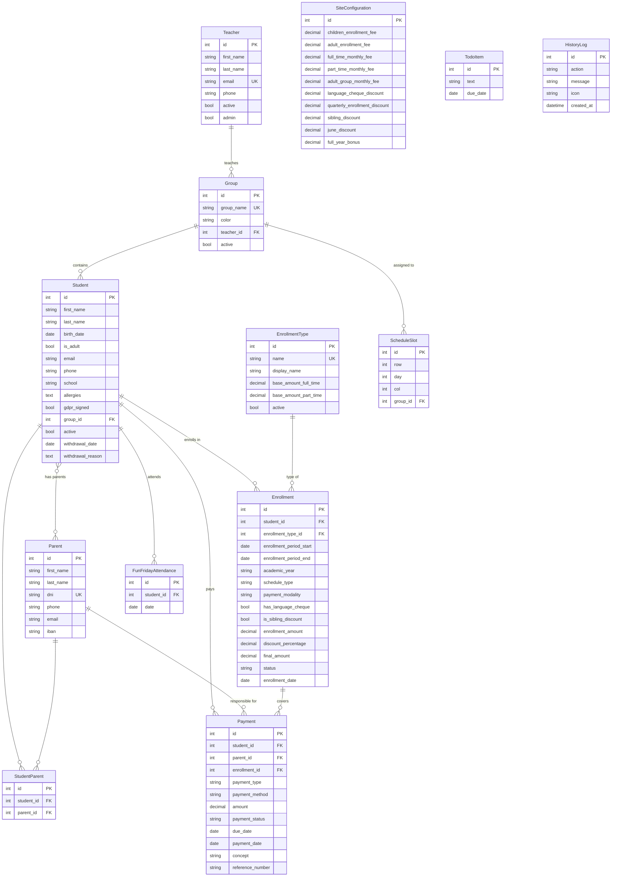
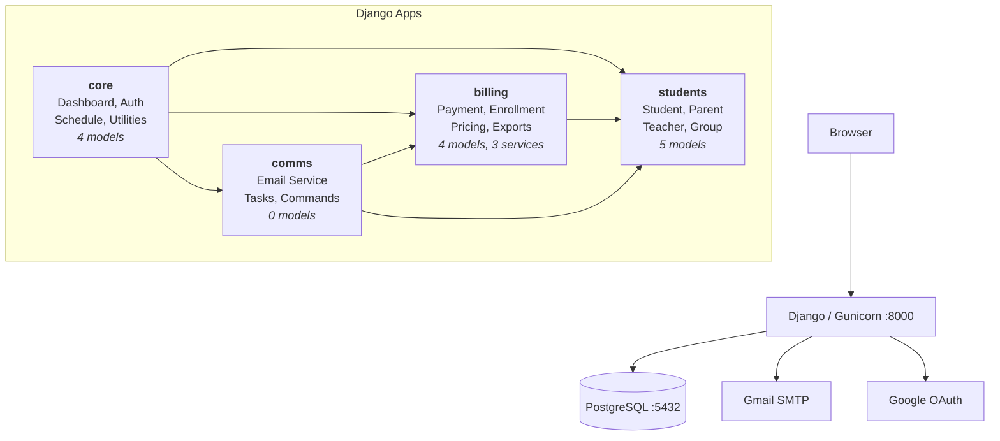
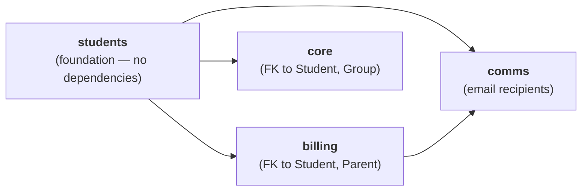

# Five a Day eVolution

<p align="center">
  
  <br>
  <em>Student Management System for Five a Day English Academy</em>
  <br>
  <em>Albacete, Spain</em>
</p>

<p align="center">
  
  
  
  
  
</p>

---

Built to centralize student records, automate billing cycles, and streamline parent communication for a small English academy managing up to 2,000 students with 3-10 admin users.

**Key objectives:**
- Replace manual Google Sheets with a searchable, relational database
- Automate monthly and quarterly payment generation and tracking
- Streamline parent communication with 12 templated email types (previews, test sends, bulk sends)
- Provide an operational dashboard for daily tasks: pending payments, birthdays, upcoming events, todos
- Support the full academic year cycle (September enrollment through June closure)

### Project Status

| Environment | Version | Status |
|-------------|---------|--------|
| **Production** | v0.0.0 |  |
| **Testing (QA)** | v1.0.1t |  |
| **Development** | v1.0.0 |  |

| | |
|---|---|
| **Documentation** | This README, [DEPLOYMENT.md](DEPLOYMENT.md), [HTTPS.md](docs/HTTPS.md), [UV.md](docs/UV.md), per-app READMEs, [CLAUDE.md](CLAUDE.md) |

| Version | Date | Description |
|---------|------|-------------|
| **v1.0.1t** | 2026-04-14 | QA/testing environment: `/testing/` dashboard, database seeding, backlog with email, error reporting, HTTPS guide, access control via `QA_TESTING_USERNAME` |
| v1.0.0 | 2026-04-11 | Security hardening, query optimization (Case/When aggregates, N+1 fixes), GCP config, transaction safety |
| v1.0.0 | 2026-04-10 | Multi-app architecture, service layer, 132 tests, frontend cleanup, full documentation |
| v0.30.2 | 2025-03-14 | History system, GDPR for adults, Docker Compose workflow |
| v0.29.0 | 2025-03-01 | Enrollment system with discounts, adult students, email automation |

---

## Table of Contents

- [Five a Day eVolution](#five-a-day-evolution)
    - [Project Status](#project-status)
  - [Table of Contents](#table-of-contents)
  - [Version History \& Roadmap](#version-history--roadmap)
    - [Roadmap](#roadmap)
      - [v1.1 — Waiting List \& Group Capacity](#v11--waiting-list--group-capacity)
      - [v1.2 — Google Sheets Integration](#v12--google-sheets-integration)
      - [v1.3 — PDF Invoice Generation](#v13--pdf-invoice-generation)
      - [v1.4 — Celery + Redis Deployment](#v14--celery--redis-deployment)
      - [v1.5 — Expense Tracking](#v15--expense-tracking)
      - [v1.6 — Multi-User Permissions](#v16--multi-user-permissions)
      - [v1.7 — Advanced Reporting \& Analytics](#v17--advanced-reporting--analytics)
      - [v1.8 — SMS Notifications (Twilio)](#v18--sms-notifications-twilio)
      - [v1.9 — Parent Portal](#v19--parent-portal)
      - [v1.10 — Audit Log \& Security Hardening](#v110--audit-log--security-hardening)
      - [v1.11 — Stripe Payment Integration](#v111--stripe-payment-integration)
      - [v1.12 — Mobile Optimization \& PWA](#v112--mobile-optimization--pwa)
  - [Tech Stack](#tech-stack)
    - [Backend](#backend)
    - [Frontend](#frontend)
    - [Infrastructure \& Deployment](#infrastructure--deployment)
    - [Python Dependencies](#python-dependencies)
  - [Database Schema](#database-schema)
    - [ER Diagram](#er-diagram)
    - [Key Constraints](#key-constraints)
  - [Development \& Docker](#development--docker)
    - [Quick Start](#quick-start)
    - [Make Commands](#make-commands)
    - [Environment Configuration](#environment-configuration)
    - [Environment Variables Reference](#environment-variables-reference)
    - [App Versioning](#app-versioning)
  - [Project Structure \& Architecture](#project-structure--architecture)
    - [Architecture Overview](#architecture-overview)
    - [App Dependency Flow](#app-dependency-flow)
    - [Directory Layout](#directory-layout)
    - [App: core](#app-core)
    - [App: students](#app-students)
    - [App: billing](#app-billing)
    - [App: comms](#app-comms)
    - [Design Decisions](#design-decisions)
  - [Features by View](#features-by-view)
    - [Home (Dashboard)](#home-dashboard)
    - [Students](#students)
    - [Student Create](#student-create)
    - [Student Detail \& Update](#student-detail--update)
    - [Payments](#payments)
    - [Schedule](#schedule)
    - [Fun Friday](#fun-friday)
    - [Apps (Email Tools)](#apps-email-tools)
    - [Management](#management)
    - [Database (All Info)](#database-all-info)
    - [Login](#login)
  - [Testing](#testing)
    - [Testing Overview](#testing-overview)
    - [Model Tests](#model-tests)
    - [Service Tests](#service-tests)
    - [View Tests](#view-tests)
  - [Migrations](#migrations)
  - [Security](#security)
    - [Authentication](#authentication)
    - [Session \& Cookie Configuration](#session--cookie-configuration)
    - [CSRF Protection](#csrf-protection)
    - [Transport Security (HTTPS)](#transport-security-https)
    - [Security Headers](#security-headers)
    - [Infrastructure \& Deployment](#infrastructure--deployment-1)
      - [Docker](#docker)
      - [Render (render.yaml)](#render-renderyaml)
      - [Google Cloud Run (gcp-cloudrun.yaml)](#google-cloud-run-gcp-cloudrunyaml)
    - [Secrets Management](#secrets-management)
    - [Email Security](#email-security)
    - [Data Protection \& Input Validation](#data-protection--input-validation)
    - [Logging \& Monitoring](#logging--monitoring)
    - [Future Security Improvements](#future-security-improvements)
  - [Testing Environment (QA)](#testing-environment-qa)
    - [What is the testing environment?](#what-is-the-testing-environment)
    - [How to access it](#how-to-access-it)
    - [What you can test](#what-you-can-test)
    - [How to report a problem](#how-to-report-a-problem)
    - [Error pages you might see](#error-pages-you-might-see)
    - [For developers: how the QA environment works](#for-developers-how-the-qa-environment-works)
      - [Access control for /testing/](#access-control-for-testing)
    - [GCP deployment plan](#gcp-deployment-plan)
  - [Contributing](#contributing)
    - [Development Workflow](#development-workflow)
    - [Code Conventions](#code-conventions)
    - [Adding a Feature](#adding-a-feature)
  - [License](#license)

---

## Version History & Roadmap

<details id="v101t" open>
<summary><strong>v1.0.1t — QA Testing Environment (current, testing branch)</strong></summary>

**Testing infrastructure**
- QA Docker Compose overlay (`docker-compose.testing.yml`) — Gunicorn, `DEBUG=False`, separate DB volume
- `.env.testing` with dedicated credentials and `DJANGO_ENV=testing`
- Database seeding command (`seed_testdata`) — 15+ students, parents, enrollments, payments
- HTTPS documentation (`HTTPS.md`) — local Docker (Nginx + self-signed cert) and GCP Cloud Run

**Testing dashboard (`/testing/`)**
- Project info card — version, environment, last commit (branch, hash, author, date)
- Error reporting toggle — sends unhandled exceptions to SUPPORT_EMAIL with full traceback
- Database seeding UI — seed or wipe-and-reseed via AJAX
- Backlog — create tasks with priority, each emailed to support automatically

**Access control**
- `qa_access_required` decorator in `core/decorators.py`
- Gated by `DJANGO_ENV=testing` + `DEBUG=False` + session username matches `QA_TESTING_USERNAME`
- Returns 404 (not 403) for unauthorized users — page appears not to exist
- Sidebar icon hidden for all non-QA users via context processor

**Bug fixes**
- Added `STATICFILES_DIRS` for `project/static/` — email CSS was missing from collectstatic manifest
- Added `SECURE_PROXY_SSL_HEADER` for HTTPS behind reverse proxies
- `QAErrorEmailMiddleware` for automated error reporting to support email

</details>

<details id="v100">
<summary><strong>v1.0.0 — Architecture Refactor & Test Suite</strong></summary>

**Architecture**
- Split monolithic `core` app into 4 apps: `students`, `billing`, `comms`, `core`
- Created service layer: EnrollmentService, PaymentService, PricingService
- Split 3,648-line views.py into 12 focused modules
- Fixed module-level querysets, wildcard imports, dual pricing source of truth

**Frontend**
- Replaced 1,178-line pre-compiled Tailwind with CDN + custom violet palette config
- Extracted ~1,400 lines of inline JS into 13 static modules
- Removed `#webcrumbs` CSS scoping wrapper
- base.html: 610 lines reduced to 305 lines

**Testing**
- 132 pytest tests: 41 model, 26 service, 65 view tests
- Tests run against PostgreSQL (same as production)
- Found and fixed Payment `active` field bug

**Templates**
- Renamed all Spanish-named email templates to English (e.g., `matricula_niño.html` -> `enrollment_child.html`)

**Documentation**
- Comprehensive README with all sections
- Per-app README.md files (core, students, billing, comms)
- CLAUDE.md for AI-assisted development
- DEPLOYMENT.md for Google Cloud Platform

</details>

<details id="v0302">
<summary><strong>v0.30.2 — Docker & History System</strong></summary>

- Docker Compose with PostgreSQL 16 + Django
- Makefile with 40+ commands for development workflow
- HistoryLog system for tracking user actions (capped at 1,000 entries)
- GDPR tracking for adult students
- Improved entrypoint script for Docker

</details>

<details id="v0290">
<summary><strong>v0.29.0 — Enrollment & Email System</strong></summary>

- Enrollment system with 3 plans (monthly full/part-time, quarterly)
- Discount engine: language cheque, sibling, quarterly, June end-of-year
- Adult student support with separate pricing
- 12 email templates with preview and test-send
- Fun Friday attendance tracking
- Support ticket system

</details>

### Roadmap

<details id="roadmap">
<summary><strong>Click to expand full roadmap (v1.1 — v1.12)</strong></summary>

#### v1.1 — Waiting List & Group Capacity

Students can be created with a `waiting_list` flag instead of being immediately enrolled. When a group has capacity (a student leaves), waiting list students are surfaced for assignment.

- New `is_waiting` boolean on Student model
- `max_students` soft limit on Group model with `student_count` tracking
- Notification when a student is deactivated and a group drops below capacity
- Waiting list management view: filter by group preference, priority by creation date
- Quick-assign flow: from waiting list or student creation, assign to group with one click
- Dashboard widget showing groups with available spots and waiting students

#### v1.2 — Google Sheets Integration

Automatic export of student/payment data to Google Sheets for existing spreadsheet workflows. Read and write via `gspread` using already-configured Google OAuth credentials.

#### v1.3 — PDF Invoice Generation

Proper PDF generation using WeasyPrint. Invoice/receipt PDFs for individual payments and quarterly summaries. Replace the current HTML-fallback tax certificate.

#### v1.4 — Celery + Redis Deployment

Full async task processing with Redis broker. Move all email sends to background tasks. Add Celery Beat for scheduled jobs: daily birthday emails at 8:00 AM, monthly payment generation on the 1st, monthly reports on the 28th.

#### v1.5 — Expense Tracking

Track academy expenses (rent, supplies, salaries) with categories, recurring templates, and monthly totals. Income-vs-expense dashboard widget showing profitability.

#### v1.6 — Multi-User Permissions

Replace SimpleAuthMiddleware with Django's built-in auth. Roles: admin (full access), teacher (read-only students + schedule), assistant (everything except configuration).

#### v1.7 — Advanced Reporting & Analytics

Monthly and yearly financial reports with charts. Student retention analytics. Payment collection rates. Group utilization metrics. Exportable to PDF.

#### v1.8 — SMS Notifications (Twilio)

SMS as an alternative notification channel for payment reminders and urgent communications. Opt-in per parent. Fallback to email when SMS fails.

#### v1.9 — Parent Portal

Read-only web portal for parents to view enrollment status, payment history, upcoming events, and download receipts/certificates. Separate authentication from admin panel.

#### v1.10 — Audit Log & Security Hardening

Full audit trail for all data changes (who changed what, when). Rate limiting on login and API endpoints. Two-factor authentication for admin users.

#### v1.11 — Stripe Payment Integration

Online payment via Stripe. Parents receive payment links by email. Automatic reconciliation with pending payments. Receipts generated on completion.

#### v1.12 — Mobile Optimization & PWA

Progressive Web App support: installable on mobile, offline-capable dashboard, push notifications for overdue payments and birthdays.

</details>

---

## Tech Stack

### Backend

| Technology | Version | Purpose |
|-----------|---------|---------|
| Python | 3.12+ | Runtime |
| Django | 5.2.5 | Web framework |
| PostgreSQL | 16 (Alpine) | Database (production, development, and testing) |
| Celery | 5.5.3 | Async task queue (eager mode without Redis, full async with Redis in v1.4) |
| Celery Beat | (bundled with Celery) | Scheduled task execution (birthday emails, payment generation — v1.4) |
| Redis | 7 (Alpine) | Message broker for Celery (planned, v1.4) |
| Gunicorn | 21.2.0 | Production WSGI server |
| WhiteNoise | 6.11.0 | Static file serving in production |

### Frontend

| Technology | Purpose |
|-----------|---------|
| [Tailwind CSS](https://tailwindcss.com/) (CDN) | Utility-first CSS with custom violet primary palette |
| [Google Fonts](https://fonts.google.com/) | Material Symbols Outlined (icons), Montserrat Alternates (login), Parisienne (login accent) |
| Vanilla JavaScript | 13 static modules — zero build tools, no framework |

### Infrastructure & Deployment

| Technology | Purpose |
|-----------|---------|
| Docker | Multi-stage build, non-root `django` user |
| Docker Compose | Service orchestration (PostgreSQL + Django) |
| Google Cloud Platform | Production hosting: Cloud Run + Cloud SQL |
| Gmail SMTP | Email sending (app password authentication) |
| Google OAuth 2.0 | Optional admin authentication |
| Make | 45+ development commands |

### Python Dependencies

| Package | Purpose |
|---------|---------|
| `django-cors-headers` | CORS handling for future API consumers |
| `django-filter` | Query filtering utilities |
| `django-extensions` | Development utilities (shell_plus, graph_models) |
| `django-gsheets` + `gspread` | Google Sheets integration (v1.2) |
| `django-redis` | Redis cache backend (v1.4) |
| `django-storages` | Cloud storage backends (future) |
| `pandas` | Data processing for exports |
| `openpyxl` | Excel file generation (.xlsx) |
| `httpx` | HTTP client for external API calls |
| `psycopg2-binary` | PostgreSQL database adapter |
| `dj-database-url` | Database URL parsing for cloud deployments |
| `python-dotenv` | Environment variable loading from .env |
| `markdown` | Markdown rendering |
| `pytest` + `pytest-django` | Testing framework |

---

## Database Schema

### ER Diagram



### Key Constraints

| Constraint | Model | Rule |
|-----------|-------|------|
| Singleton | SiteConfiguration | Always pk=1, cannot be deleted |
| Unique active | Enrollment | Only one active enrollment per student |
| Unique pair | StudentParent | (student, parent) |
| Unique pair | FunFridayAttendance | (student, date) |
| Unique triple | ScheduleSlot | (row, day, col) |
| Unique | Teacher.email, Group.group_name, Parent.dni, EnrollmentType.name | |

---

## Development & Docker

### Quick Start

```bash
# Clone the repository
git clone https://github.com/starseeker-code/five-a-day.git
cd five-a-day

# Configure environment
cp .env.example .env   # Edit with your values (see Environment Configuration below)
```

**Docker (recommended):**

```bash
make build             # Build images
make up                # Start PostgreSQL + Django → http://localhost:8000
make migrate           # Apply migrations (first time only)
```

**Local development (no Docker):**

```bash
uv sync                # Install dependencies
cd project
python manage.py migrate
python manage.py runserver
```

> **Important**: The `.env` file controls whether the app runs in production or development mode. Before starting, set at minimum:
> - `DJANGO_ENV=development` — enables development behaviors (auto superuser, no collectstatic)
> - `DJANGO_DEBUG=true` — enables Django debug mode, detailed error pages
> - `POSTGRES_PASSWORD` — required for database connection

### Make Commands

Run `make` or `make help` for the full list. Key commands:

| Command | Description |
|---------|-------------|
| **Lifecycle** | |
| `make up` | Start all services (detached) |
| `make down` | Stop and remove containers |
| `make dev` | Start in foreground (logs visible) |
| `make rebuild` | Full rebuild (no cache) + start |
| **Django** | |
| `make shell` | Django shell in container |
| `make migrate` | Apply migrations |
| `make makemigrations` | Create migrations (all 4 apps) |
| `make check` | Django system checks |
| **Database** | |
| `make dbshell` | PostgreSQL shell |
| `make backup` | Dump DB to backups/ |
| `make reset-db` | Recreate database (destructive!) |
| **Testing** | |
| `make test` | Run all tests in Docker (PostgreSQL) |
| `make test-local` | Run tests locally against Docker PostgreSQL |
| `make test-sqlite` | Run tests with SQLite (no Docker needed) |
| `make test-coverage` | Tests with HTML coverage report |
| `make test-models` | Only model tests |
| `make test-services` | Only service tests |
| `make test-views` | Only view tests |
| `make test-fast` | Stop on first failure |
| `make test-k K=payment` | Run tests matching keyword |
| **Versioning** | |
| `make version V=1.1.0` | Update version in pyproject.toml + settings.py |
| `make version` | Show current version locations |
| **Email & Payments** | |
| `make send-test-email` | Send test birthday email |
| `make test-all-emails` | List all email templates |
| `make generate-payments` | Generate current month's payments |
| `make generate-payments-dry` | Preview without creating |
| **Health** | |
| `make health` | Full health check (Django + DB + HTTP) |
| `make check-deploy` | Django deployment checklist |

### Environment Configuration

The project supports three environments, controlled by `DJANGO_ENV` and `DJANGO_DEBUG`:

| Environment | `DJANGO_ENV` | `DJANGO_DEBUG` | Database | Static Files | Use Case |
|------------|-------------|---------------|----------|-------------|----------|
| **Production** | `production` | `false` | PostgreSQL (Cloud SQL) | WhiteNoise + collectstatic | Live deployment |
| **Development** | `development` | `true` | PostgreSQL (Docker) | Django dev server | Local coding |
| **Testing** | (via settings_test.py) | `false` | PostgreSQL (Docker) | Simple storage | `make test` |

> **Defaults are production-safe**: `DJANGO_DEBUG` defaults to `false` and `DJANGO_ENV` defaults to `development`. In production, always set `DJANGO_ENV=production` and ensure `DJANGO_SECRET_KEY` is a strong random value.

The database is **always PostgreSQL** — in Docker development, in tests, and in production. Tests run against the same Docker PostgreSQL container to ensure realistic behavior. For quick local test runs without Docker, use `make test-sqlite`.

### Environment Variables Reference

| Variable | Description | Required | Default |
|----------|-------------|----------|---------|
| **Core** | | | |
| `DJANGO_ENV` | Environment: `development` / `production` | No | `development` |
| `DJANGO_DEBUG` | Debug mode: `true` / `false` | No | `false` |
| `DJANGO_SECRET_KEY` | Secret key | **Yes in production** | dev fallback |
| `DJANGO_ALLOWED_HOSTS` | Comma-separated hosts | No | `localhost,127.0.0.1` |
| **Database** | | | |
| `DATABASE` | Set to `postgres` for PostgreSQL | No | `postgres` |
| `DATABASE_URL` | Full URL (Cloud deployments) | No | — |
| `POSTGRES_DB` | Database name | No | `fiveaday_db` |
| `POSTGRES_USER` | Database user | No | `fiveaday_user` |
| `POSTGRES_PASSWORD` | Database password | **Yes** | — |
| `POSTGRES_HOST` | Database host | No | `db` (Docker) |
| `POSTGRES_PORT` | Database port | No | `5432` |
| **Email** | | | |
| `EMAIL_HOST_USER` | Gmail address | For email features | — |
| `EMAIL_SECRET` | Gmail app password | For email features | — |
| `SUPPORT_EMAIL` | Support ticket recipient | No | — |
| `EMAIL_TEST_1` / `EMAIL_TEST_2` | Test email recipients | No | — |
| **Auth** | | | |
| `LOGIN_USERNAME` | Admin username | No | `fiveaday` |
| `LOGIN_PASSWORD` | Admin password | No | `Fiveaday123!` |
| `GOOGLE_CLIENT_ID` | OAuth client ID | For Google login | — |
| `GOOGLE_CLIENT_SECRET` | OAuth client secret | For Google login | — |
| `GOOGLE_REDIRECT_URI` | OAuth callback URL | For Google login | auto-detected |
| `GOOGLE_ALLOWED_EMAIL` | Restrict Google login | No | `EMAIL_HOST_USER` |
| **Other** | | | |
| `APP_VERSION` | Version string | No | from settings.py |
| `CELERY_BROKER_URL` | Redis URL for Celery | No | eager mode |
| `SESSION_COOKIE_AGE` | Session duration (seconds) | No | `86400` (24h) |
| `LOG_LEVEL` | Logging level | No | `DEBUG`/`INFO` |

### App Versioning

The app version is defined in **two places** and should be updated together:

1. **`pyproject.toml`** line 3: `version = "x.y.z"` — package metadata
2. **`project/settings.py`** line 17: `APP_VERSION = os.getenv("APP_VERSION", "x.y.z")` — runtime fallback

Use `make version V=1.1.0` to update both at once. The version appears in:
- `/health/` endpoint response
- Support ticket emails
- Can be overridden at runtime via the `APP_VERSION` environment variable

---

## Project Structure & Architecture

### Architecture Overview



### App Dependency Flow



### Directory Layout

```text
five-a-day/
├── project/
│   ├── project/                  Django settings module
│   │   ├── settings.py           Main settings
│   │   ├── settings_test.py      Test overrides (PostgreSQL or SQLite)
│   │   ├── urls.py               Root URL conf → includes 4 app URL files
│   │   ├── celery.py             Celery configuration
│   │   └── wsgi.py / asgi.py
│   │
│   ├── core/                     Dashboard, Auth, Schedule, Utilities
│   │   ├── models.py             TodoItem, HistoryLog, FunFridayAttendance, ScheduleSlot
│   │   ├── views/                12 view modules
│   │   ├── constants.py          DIAS_ES, MESES_ES, SCHEDULED_APPS
│   │   ├── middleware.py         SimpleAuthMiddleware
│   │   ├── context_processors.py Notifications injected into all templates
│   │   ├── transactions.py       Optimized queryset builders
│   │   ├── templates/            ALL HTML templates (base, pages, emails)
│   │   └── static/               CSS (app.css) + JS (13 modules) + images
│   │
│   ├── students/                 People Management
│   │   ├── models.py             Student, Parent, StudentParent, Teacher, Group
│   │   ├── forms.py              StudentForm, ParentForm, ParentFormSet
│   │   ├── admin.py              Custom admin with inlines
│   │   └── urls.py               12 URL patterns
│   │
│   ├── billing/                  Financial Management
│   │   ├── models.py             SiteConfiguration, EnrollmentType, Enrollment, Payment
│   │   ├── forms.py              EnrollmentForm (delegates to service)
│   │   ├── constants.py          Pricing seeds, choice tuples
│   │   ├── services/             EnrollmentService, PaymentService, PricingService
│   │   ├── exports.py            Excel/CSV builders
│   │   ├── admin.py              Payment + Enrollment admin with actions
│   │   ├── urls.py               20 URL patterns
│   │   └── management/commands/  generate_payments
│   │
│   ├── comms/                    Communications
│   │   ├── services/             EmailService + 12 email functions + PDF gen
│   │   ├── tasks.py              6 Celery tasks
│   │   ├── urls.py               10 URL patterns
│   │   └── management/commands/  send_email, test_all_emails
│   │
│   ├── tests/                    pytest suite (174 tests)
│   └── conftest.py               Shared fixtures
│
├── Dockerfile                    Multi-stage build
├── docker-compose.yml            PostgreSQL + Django
├── Makefile                      45+ commands
├── pyproject.toml                Dependencies (uv/pip compatible)
├── CLAUDE.md                     AI development context
└── DEPLOYMENT.md                 GCP deployment guide
```

### App: core

Dashboard, authentication, scheduling, and shared utilities. Owns all views and templates.

| Component | Details |
|-----------|---------|
| **Models** | TodoItem, HistoryLog (1000-entry cap), FunFridayAttendance, ScheduleSlot |
| **Views** | 12 modules: auth, dashboard, students, parents, payments, management, app_forms, schedule, fun_friday_attendance, todos, support, errors |
| **Middleware** | SimpleAuthMiddleware — session-based, protects all routes except /login/, /health/, /static/ |
| **Templates** | base.html (layout), 15+ page templates, 12 email templates, error pages |
| **Static** | app.css (sidebar/icons), 13 JS modules, logo |

See [core/README.md](project/core/README.md) for details.

### App: students

People management — the foundation app with no external dependencies.

| Component | Details |
|-----------|---------|
| **Models** | Student (with age calc, withdrawal tracking), Parent (DNI unique), Teacher, Group, StudentParent (M2M through) |
| **Forms** | StudentForm (birth_date validation), ParentForm (DNI validation), ParentFormSet |
| **Admin** | StudentAdmin with StudentParentInline, ParentAdmin with ParentStudentInline |
| **URLs** | 12 patterns: CRUD + search + fun friday attendance |

See [students/README.md](project/students/README.md) for details.

### App: billing

Financial management with a dedicated service layer.

| Component | Details |
|-----------|---------|
| **Models** | SiteConfiguration (singleton pricing), EnrollmentType (plan types), Enrollment (with discount flags), Payment (with overdue detection) |
| **Services** | EnrollmentService (creation + discounts), PaymentService (generation + calculations), PricingService (centralized config access) |
| **Constants** | Pricing seeds, ENROLLMENT_TYPE_CHOICES, SCHEDULE_TYPE_CHOICES, PAYMENT_METHOD_CHOICES, etc. |
| **Exports** | build_database_workbook() → multi-sheet .xlsx |
| **Commands** | `generate_payments --month X --year Y [--dry-run]` |
| **URLs** | 20 patterns: payment CRUD, enrollment API, management, exports |

See [billing/README.md](project/billing/README.md) for details.

### App: comms

Email communications — no database models, pure service layer.

| Component | Details |
|-----------|---------|
| **EmailService** | Generic HTML email sender with inline images and attachments |
| **Email functions** | 12 convenience functions (birthday, welcome, enrollment, payment reminder, receipts, tax cert, etc.) |
| **Celery tasks** | 6 tasks with retry logic: welcome, birthday (single + batch), payment reminders, generic, enrollment confirmation |
| **Commands** | `send_email --template X [--test]`, `test_all_emails [--only X,Y]` |
| **URLs** | 10 patterns: all email app form views |

See [comms/README.md](project/comms/README.md) for details.

### Design Decisions

| Decision | Rationale |
|----------|-----------|
| Views stay in core | Models split across apps, but all views in `core/views/` avoids template/URL fragmentation. Each app's `urls.py` imports from core. |
| Service layer in billing | Business logic (pricing, discounts, payment generation) extracted from forms/views into testable services. |
| SiteConfiguration singleton | All pricing editable from UI. Auto-creates with defaults. No hardcoded prices in views. |
| Session-based auth | SimpleAuthMiddleware with env var credentials. Sufficient for 3-10 users until v1.6. |
| Tailwind CDN | Zero build tools. All utilities available instantly. Custom violet palette in config block. |
| PostgreSQL everywhere | Same database engine in development, testing, and production. Avoids SQLite behavioral differences. |

---

## Features by View

### Home (Dashboard)

The main landing page. Shows real-time operational data for the current month.

- **Pending payments card** — count + student names with amounts. Click count to expand modal with full student list and individual amounts.
- **Birthdays card** — monthly count with today's birthdays highlighted by name.
- **Upcoming events** — Fun Fridays and scheduled email sends for the rest of the month, linked to their form views.
- **Monthly revenue** — expected total (all due this month) vs completed total (paid this month), with payment count.
- **Todo list** — create tasks with date selector (today / this week's Friday / custom date picker). Overdue items shown in red. Check to complete (deletes + logs to HistoryLog). Sorted by due date.
- **History dropdown** — lazy-loaded, paginated (20 per page) log of all actions: payments completed, students enrolled, emails sent, config changes.
- **Notification bell** — badge count of today's due tasks + today's scheduled email sends.

### Students

Student management with toolbar, inline actions, and real-time filtering.

- **Student table** — columns: name, group (color badge), enrollment type, Fun Friday status icon. Rows have `data-*` attributes for client-side filtering.
- **Search** — real-time filter by name (client-side, no server round-trip).
- **Sort** — 4-state cycle: date ascending → date descending → name A-Z → name Z-A.
- **Fun Friday toggle** — per-row button. States: green check (registered this week), amber check (this + last week), amber X (only last week), grey X (neither). AJAX POST to `/api/students/{id}/fun-friday/toggle/`.
- **Fun Friday filter** — 3-state cycle: all → not this week → this week only.
- **Type filter** — 4-state cycle: all → children only → adults only → language cheque students.
- **New student dropdown** — choose creation flow: new parent → new student, existing parent → new student, or adult student (no parent).

### Student Create

Multi-step creation form with live price calculator.

- **Parent selection** — either create new (name, DNI, phone, email, IBAN) or search existing parents with pagination (6 per page).
- **Student fields** — first name, last name, birth date (validated: not future), school, allergies, GDPR consent, group selector.
- **Enrollment plan** — dropdown: monthly full-time (2 days/week), monthly part-time (1 day/week), quarterly. Checkboxes: language cheque discount, sibling discount (with sibling search), special/manual price.
- **Live price calculator** — updates as you change plan/discounts. Shows base price, strikethrough, final price, and breakdown text (e.g., "trimestral incl. -5%, -20 cheque").
- **Adult mode** — no parent needed, email/phone on student, fixed adult_group pricing.
- **On submit** — atomic transaction creates: Student → StudentParent link → Enrollment (active) → Payment (enrollment fee, pending) → HistoryLog entry → Celery welcome email task.
- **Success page** — shows student name, enrollment fee amount. Auto-redirects to student list after 4 seconds. Option to "create sibling" (pre-fills same parent).

### Student Detail & Update

- **Detail view** — personal info, linked parents with contact details, enrollment history (all enrollments, active highlighted), payment history, Fun Friday dates with add/remove.
- **Enrollment modality toggle** — switch monthly ↔ quarterly via AJAX.
- **Update view** — same form as create, pre-filled. Saves student changes + finishes old enrollment + creates new enrollment.

### Payments

Payment management with search, filtering, pagination, and quick-complete.

- **Stats bar** — 4 cards: expected total, completed total, pending total, overdue total. All for the current period.
- **Payment table** — columns: student, parent, concept, amount, method, status badge, due date, payment date. Client-side pagination (10 per page).
- **Search** — real-time filter by student name, parent name, concept, or reference number.
- **Status filter** — 4-state cycle: all → pending → completed → overdue.
- **Type filter** — 5-state: all → enrollment → monthly → quarterly → other.
- **Quick complete** — click a pending status badge → dropdown with 3 payment methods (cash / transfer / card) → one click marks as completed with today's date, logs to history.
- **Create payment** — autocomplete student search → autocomplete parent search → validates student-parent relationship → select type, method, amount, dates, concept.
- **Detail view** — read-only display of all payment fields.
- **Export** — CSV download (all payments) and Excel download (full database: students + enrollments + payments as multi-sheet .xlsx).

### Schedule

Weekly class timetable with drag-and-drop group assignment.

- **Grid** — 5 columns (Mon-Fri) × 3 time rows × 2 sub-columns. Time slots: 16:10-17:30, 17:40-19:00, 19:10-20:30. Friday: 16:00-17:20.
- **Edit mode** — toggle button. In edit mode, click any cell → dropdown to assign a group. Saves via AJAX to `/api/schedule/slot/save/`.
- **Cell display** — group color, group name, teacher first name, student first names.

### Fun Friday

Dedicated attendance management for the weekly Fun Friday event.

- **Student list** — all non-adult active students, grouped by class group.
- **Toggle buttons** — same icon system as student list. AJAX toggles.
- **This week / Last week panels** — lists of registered students for each Friday.
- **Search, sort, filter** — same tools as student list.

### Apps (Email Tools)

Hub page listing all 10 email communication tools. Each follows a consistent pattern:

1. **Form** — fields specific to the email type (dates, activity description, year, etc.)
2. **Email preview** — collapsible panel showing the rendered email HTML. "Refresh" button fetches live preview with current form data via AJAX.
3. **Test send** — sends to `EMAIL_TEST_1` / `EMAIL_TEST_2` env vars for verification before bulk send.
4. **Send** — iterates over qualifying parent emails, sends individually, counts success/failures, logs to HistoryLog, shows flash messages.

| App | Email Template | Recipients | Trigger |
|-----|---------------|------------|---------|
| Fun Friday | `fun_friday.html` | Parents with active non-adult students | Weekly, manual |
| Payment Reminder | `payment_reminder.html` | Parents with active students | Monthly, manual |
| Vacation Closure | `vacation_closure.html` | All parents | Manual |
| Tax Certificate | `tax_certificate.html` | Parents with completed payments in year | Yearly (April) |
| Monthly Report | `monthly_report.html` | All parents (personalized per parent) | Monthly, manual |
| Birthday | `happy_birthday.html` | Parents of today's birthday students | Daily, manual |
| Receipts (child) | `receipt_quarterly_child.html` | Parents with active children | Quarterly, manual |
| Receipts (adult) | `receipt_adult.html` | Adult students | Monthly, manual |
| Welcome | `welcome_student.html` | Parent of new student | On creation (auto) |
| Enrollment | `enrollment_child.html` / `enrollment_adult.html` | Parent of enrolled student | On enrollment |

### Management

Admin configuration panel with live editing.

- **Pricing config** — all fees and discounts from SiteConfiguration. Toggle edit mode → modify values → save via AJAX. Fields: children/adult enrollment fees, full-time/part-time/adult monthly fees, 8 discount types.
- **Teachers** — create via modal (name, email, phone, admin flag). Validates unique email. Lists active teachers.
- **Groups** — create via modal (name, color picker, teacher dropdown). Teacher list populated via AJAX from `/api/teachers/`. Validates unique name.
- **Language cheque API** — `GET /api/students/language-cheque/` returns all students with active language cheque for government reporting.

### Database (All Info)

Paginated read-only tables of all data.

- **Students tab** — sortable by creation date, ID, first name, last name. Paginated (20 per page).
- **Payments tab** — sortable by creation date or student name. Paginated (20 per page).
- **Excel export button** — downloads complete database as `five_a_day_YYYYMMDD.xlsx`.

### Login

Standalone page with custom styling (does not extend base.html).

- **Credentials login** — username/password from `LOGIN_USERNAME` / `LOGIN_PASSWORD` env vars.
- **Google OAuth** — optional. Button shown if `GOOGLE_CLIENT_ID` and `GOOGLE_CLIENT_SECRET` are configured. Validates email matches `GOOGLE_ALLOWED_EMAIL`. Stores Google credentials in session for Gmail/Sheets API access.
- **Session** — sets `is_authenticated=True` and `username` in Django session. 24-hour expiry.

---

## Testing

### Testing Overview

| Metric | Value |
|--------|-------|
| **Total tests** | 174 |
| **Test files** | 7 (models, services, views, context_processors, middleware, email_service, email_functions) |
| **Runtime** | ~6 seconds |
| **Database** | PostgreSQL (same as production) — **always use `make test`** |
| **Framework** | pytest 9 + pytest-django 4.12 + pytest-cov 7.1 |
| **Linting** | Ruff (check + format) via pre-commit hooks |
| **Settings** | `project/settings_test.py` |
| **Fixtures** | `conftest.py` — 15 shared fixtures |

```bash
make test              # Inside Docker (PostgreSQL)
make test-local        # Local against Docker PostgreSQL
make test-sqlite       # Local with SQLite (no Docker)
make test-coverage     # Generate HTML coverage report
make test-fast         # Stop on first failure
make test-k K=payment  # Run tests matching keyword
```

### Model Tests

41 tests in `test_models.py` covering model logic, properties, and database constraints.

| Group | Count | Coverage |
|-------|-------|----------|
| Academic year helpers | 5 | `current_academic_year()` for both semesters, `academic_year_start_date`, `academic_year_end_date` |
| SiteConfiguration | 4 | Singleton creation, pk=1 enforcement, delete prevention, default values |
| Student & Parent | 6 | Properties (`full_name`, `age`), string representation, M2M relationship, DNI uniqueness |
| Student gender | 2 | Default gender value, gender choices |
| Teacher & Group | 4 | Properties, FK relationship, name uniqueness |
| Enrollment | 5 | Properties (`is_paid`, `remaining_amount`), string representation, unique active constraint |
| Cancelled enrollment | 1 | Cancelled enrollment status |
| Inactive student | 1 | Inactive student exists |
| Payment | 4 | `is_overdue` detection (past/future/completed), `clean()` auto-sets payment_date |
| TodoItem & HistoryLog | 5 | `is_overdue`, log creation, 1000-entry cap, debounced logging |
| FunFridayAttendance | 1 | Unique (student, date) constraint |
| ScheduleSlot | 3 | Slot creation, unique (row, day, col) constraint, null group |

### Service Tests

26 tests in `test_services.py` covering business logic in the service layer.

| Group | Count | Coverage |
|-------|-------|----------|
| PricingService | 7 | Monthly fees by schedule type, enrollment fees by student type, quarterly price calculation |
| EnrollmentService | 9 | All enrollment plans (monthly full/part, quarterly), all discount types (sibling, language cheque, both), special pricing, adult enrollment, minimum amount floor (0.01) |
| EnrollmentService errors | 2 | Missing enrollment type validation, payment statistics |
| PaymentService | 8 | Monthly/quarterly amount calculations with all discount combos, June bonus, payment completion, academic month/quarter validation |

### View Tests

65 tests in `test_views.py` covering HTTP responses, AJAX APIs, and user flows.

| Group | Count | Coverage |
|-------|-------|----------|
| Authentication | 6 | Unauthenticated redirect, login page, health check, valid/invalid login, logout |
| Dashboard | 2 | Dashboard, all_info |
| Student views | 4 | Student list, detail, create page, search API |
| Parent views | 2 | Parent create page, search API |
| Payment views | 9 | Payments list, create page, detail, quick-complete (valid + invalid), statistics, CSV export, student-parent validation |
| Payment CRUD | 5 | Delete, deactivate, update JSON, get details API, search |
| Todo & History API | 5 | Todo create/complete/empty text, history list + pagination |
| Management | 6 | Management page, config update, teacher create (+ duplicate), group create, teachers API |
| Email forms | 10 | Apps page, all 8 form pages load + welcome redirect (parametrized) |
| Enrollment API | 3 | Modality update (valid + invalid), language cheque endpoint |
| Error pages | 5 | All 5 error pages render with correct status codes (parametrized) |
| Schedule | 2 | Schedule page, Fun Friday page |
| Fun Friday | 4 | Toggle (valid + adult rejected), add attendance, remove attendance |
| Support | 2 | Missing message validation, no email configuration |

---

## Migrations

All migrations were regenerated from scratch during the v1.0.0 multi-app split.

| App | Migration | Changes | Depends On |
|-----|-----------|---------|------------|
| `students` | `0001_initial` | Teacher, Group, Parent, Student, StudentParent | — |
| `students` | `0002` | Student gender field, StudentParent UniqueConstraint | `students.0001` |
| `billing` | `0001_initial` | SiteConfiguration, EnrollmentType, Enrollment, Payment | `students.0001` |
| `billing` | `0002` | Enrollment academic_year index | `billing.0001`, `students.0002` |
| `core` | `0001_initial` | TodoItem, HistoryLog, FunFridayAttendance, ScheduleSlot | `students.0001` |
| `core` | `0002` | UniqueConstraint for FunFridayAttendance and ScheduleSlot (replaces unique_together) | `core.0001`, `students.0002` |
| `comms` | — | (no models) | — |

```bash
# After modifying models:
make makemigrations   # Creates migrations for all 4 apps
make migrate          # Applies them
```

---

## Security

This section documents every security decision, mechanism, and configuration in the project.

### Authentication

**Mechanism**: Custom session-based authentication with two backends — environment credentials and Google OAuth 2.0.

| Component | File | How it works |
|-----------|------|-------------|
| Login view | `core/views/auth.py` | Validates username/password against `LOGIN_USERNAME`/`LOGIN_PASSWORD` env vars. Sets `request.session["is_authenticated"] = True`. No hardcoded fallbacks — if env vars are missing, login is refused with an error message. |
| Google OAuth | `core/views/auth.py` | Full OAuth 2.0 code flow via `google-auth-oauthlib`. State token stored in session and verified on callback. ID token verified server-side via Google's public keys. Only the email matching `GOOGLE_ALLOWED_EMAIL` (or `EMAIL_HOST_USER` / `DJANGO_SUPERUSER_EMAIL`) is authorized. |
| Auth middleware | `core/middleware.py` | `SimpleAuthMiddleware` protects all routes. Public URLs use exact match for `/login/` and prefix match for `/health/`, `/static/`, `/media/`, `/auth/google/` (covers `/callback/`). All other paths require `session["is_authenticated"]`. |
| OAuth credentials | `core/views/auth.py` | Google tokens (access, refresh) are stored in session server-side. `client_secret` is never sent to the frontend. Allowed email check is backend-only. |

**Design decisions**:
- No Django User model — the system has 3-10 trusted admin users, so session-based auth with env var credentials is simpler and sufficient.
- Google OAuth is optional — if `GOOGLE_CLIENT_ID`/`GOOGLE_CLIENT_SECRET` are not set, the OAuth button is hidden.
- `OAUTHLIB_INSECURE_TRANSPORT` is only set when `DEBUG=True` (for local HTTP testing).

### Session & Cookie Configuration

All cookie flags are enforced via `settings.py` with environment-aware defaults:

| Setting | Development | Production | Purpose |
|---------|------------|------------|---------|
| `SESSION_COOKIE_AGE` | 86400 (24h) | 86400 (24h) | Session lifetime |
| `SESSION_COOKIE_HTTPONLY` | `True` | `True` | Prevents JavaScript access to session cookie |
| `SESSION_COOKIE_SAMESITE` | `Lax` | `Strict` | Prevents cross-site request forgery via session cookies |
| `SESSION_COOKIE_SECURE` | `False` | `True` | Requires HTTPS for cookie transmission |
| `CSRF_COOKIE_HTTPONLY` | `False` | `True` | Prevents JavaScript access to CSRF cookie in production |
| `CSRF_COOKIE_SAMESITE` | `Lax` | `Strict` | Prevents cross-site CSRF cookie leakage |
| `CSRF_COOKIE_SECURE` | `False` | `True` | Requires HTTPS for CSRF cookie |

Production defaults are applied automatically when `DEBUG=False` — no manual override needed in env vars.

### CSRF Protection

- Django's `CsrfViewMiddleware` is active in the middleware stack.
- All POST endpoints receive CSRF validation. JavaScript AJAX requests use `getCsrfToken()` (reads from cookies) and send via `X-CSRFToken` header.
- `CSRF_TRUSTED_ORIGINS` is configured per deployment (`render.yaml`, `gcp-cloudrun.yaml`).
- Only exception: `@csrf_exempt` on `/health/` endpoint (GET-only, returns `{"status": "healthy"}`).

### Transport Security (HTTPS)

When `DEBUG=False`, the following are enforced via `settings.py`:

| Setting | Value | Effect |
|---------|-------|--------|
| `SECURE_SSL_REDIRECT` | `True` | All HTTP requests redirected to HTTPS |
| `SECURE_HSTS_SECONDS` | `31536000` (1 year) | Browser remembers to use HTTPS |
| `SECURE_HSTS_INCLUDE_SUBDOMAINS` | `True` | HSTS applies to all subdomains |
| `SECURE_HSTS_PRELOAD` | `True` | Eligible for browser HSTS preload lists |

All settings are environment-controlled and only activate when `DEBUG=False`.

### Security Headers

| Header | Setting | Value | Effect |
|--------|---------|-------|--------|
| `X-Frame-Options` | `X_FRAME_OPTIONS` | `DENY` | Prevents clickjacking — page cannot be embedded in iframes |
| `X-Content-Type-Options` | `SECURE_CONTENT_TYPE_NOSNIFF` | `True` | Prevents MIME type sniffing attacks |
| `X-XSS-Protection` | `SECURE_BROWSER_XSS_FILTER` | `True` | Enables browser XSS filter (legacy, supplementary) |

### Infrastructure & Deployment

#### Docker

| Decision | Implementation |
|----------|---------------|
| Non-root container | `Dockerfile` creates user `django` (uid 1000) and runs as `USER django` |
| Multi-stage build | Builder stage compiles dependencies; runtime stage uses `python:3.12-slim` without build tools |
| No secrets in image | `.dockerignore` excludes `.env*`, `scripts/`, `.git/` |
| DB port restricted | `docker-compose.yml` binds PostgreSQL to `127.0.0.1:5432` only (not exposed to network) |
| Health checks | Database has auth-checking healthcheck; web service uses `/health/` endpoint |
| Seed script guard | `scripts/reset_seed_dev_data.py` aborts if `DJANGO_ENV=production` or `DEBUG=False` |

#### Render (render.yaml)

| Decision | Implementation |
|----------|---------------|
| Auto-generated secrets | `DJANGO_SECRET_KEY` and `DJANGO_SUPERUSER_PASSWORD` use `generateValue: true` |
| Dashboard-only secrets | `DJANGO_SUPERUSER_USERNAME`, `DJANGO_SUPERUSER_EMAIL`, `LOGIN_USERNAME`, `LOGIN_PASSWORD`, `EMAIL_HOST_USER`, `EMAIL_SECRET` use `sync: false` (set in Render dashboard, not in YAML) |
| SSL enforced | `SECURE_SSL_REDIRECT=True`, all cookie secure flags enabled |
| Strict cookies | `SESSION_COOKIE_SAMESITE=Strict`, `CSRF_COOKIE_SAMESITE=Strict`, `CSRF_COOKIE_HTTPONLY=True` |

#### Google Cloud Run (gcp-cloudrun.yaml)

| Decision | Implementation |
|----------|---------------|
| Secret Manager | All credentials (`DJANGO_SECRET_KEY`, `LOGIN_*`, `EMAIL_SECRET`, `POSTGRES_*`, `GOOGLE_*`) loaded from GCP Secret Manager via `secretKeyRef` |
| Service account | Runs under dedicated `fiveaday-sa` service account with least-privilege IAM |
| Autoscaling | min=0, max=3 instances; startup probe with 50s timeout |
| Probes | Startup probe + liveness probe on `/health/` |

### Secrets Management

| Rule | Implementation |
|------|---------------|
| No hardcoded credentials | `auth.py` requires `LOGIN_USERNAME`/`LOGIN_PASSWORD` env vars — refuses login if missing |
| No secrets in YAML | `render.yaml` uses `generateValue` or `sync: false`; `gcp-cloudrun.yaml` uses Secret Manager refs |
| No secrets in Docker image | `.dockerignore` excludes all `.env*` files |
| `.gitignore` coverage | `.env*` pattern excludes all env file variants |
| Production startup validation | `settings.py` raises `ValueError` if `SECRET_KEY` is the dev default and `DEBUG=False` |

### Email Security

| Decision | Implementation |
|----------|---------------|
| TLS enforced | `EMAIL_USE_TLS=True`, port 587 (STARTTLS) |
| App Password | Uses Gmail App Password (not account password) via `EMAIL_SECRET` env var |
| `fail_silently` | Defaults to `False` for single sends (raises on failure); `True` for bulk sends (logs failures) |
| No PII in logs | Celery tasks log by ID (`student_id=X`) not by name/email/DNI |
| Template auto-escaping | All email templates use Django's default auto-escaping — `{{ variable }}` is HTML-safe |
| Inline images | Attached via MIME `Content-ID` headers, not external URLs |

### Data Protection & Input Validation

| Layer | Mechanism |
|-------|-----------|
| **Models** | `DecimalField` with `MinValueValidator` for all money fields. `UniqueConstraint` for enrollment/schedule/attendance integrity. `PROTECT` on foreign keys prevents orphaned records. |
| **Forms** | Django `ModelForm` with `clean_*()` validators. Date fields accept `%Y-%m-%d` and `%d/%m/%Y`. DNI validated for minimum length. |
| **Views** | `get_object_or_404` for safe lookups. `@require_http_methods` on all AJAX endpoints. `Decimal(str(...))` for safe numeric conversion. `json.JSONDecodeError` caught explicitly. |
| **Services** | `transaction.atomic()` wraps multi-model writes (enrollment creation, payment completion). `ValueError` raised for missing config. |
| **GDPR** | `gdpr_signed` field on Student. No student data exposed without authentication. PII removed from log messages. |

### Logging & Monitoring

- Console logging via `StreamHandler` with configurable `LOG_LEVEL` env var.
- Separate loggers for `django` framework and project modules.
- `HistoryLog` model tracks user actions (payment completed, student enrolled, config updated) — capped at 1000 entries with automatic cleanup.
- Celery tasks log by entity ID, not PII.

### Future Security Improvements

These are not blockers but would strengthen the system for scale or compliance:

| Priority | Improvement | Why |
|----------|------------|-----|
| **High** | Rate limiting on login (`django-ratelimit`, 5 attempts/15 min per IP) | Prevents brute force. Currently no protection. |
| **High** | Content-Security-Policy header | Prevents XSS. Currently absent — Tailwind CDN requires `unsafe-inline` for styles, but scripts can be locked down. |
| **High** | Referrer-Policy header (`strict-origin-when-cross-origin`) | Prevents referrer leakage to external links. Currently absent. |
| **Medium** | Session rotation on OAuth login (`request.session.create()`) | Prevents session fixation. Currently session ID persists through OAuth flow. |
| **Medium** | Inactivity timeout (30 min idle logout) | 24h session is long for sensitive student data. |
| **Medium** | Security event audit log (failed logins with IP, CSRF failures) | Currently no visibility into attack attempts. |
| **Medium** | Permissions-Policy header | Disables camera, microphone, geolocation APIs the app doesn't need. |
| **Medium** | `Argon2` password hasher (if Django User model is ever adopted) | Stronger than default PBKDF2. |
| **Low** | Request ID tracking (`X-Request-ID` middleware) | Enables log correlation across services. |
| **Low** | `detect-secrets` pre-commit hook | Prevents accidental secret commits in the future. |
| **Low** | Migrate to OAuth-only (deprecate password login) | Reduces credential attack surface to zero. |
| **Low** | Web Application Firewall (WAF) rules at cloud provider level | Blocks common attack patterns before they reach Django. |

---

## Testing Environment (QA)

> **This section is for testers, teachers, and anyone helping us try out the application before it goes live.**
> You do not need to be a programmer to use the testing environment. If something looks wrong or confusing, that is exactly the kind of feedback we need.

### What is the testing environment?

The testing environment is a copy of the real application that runs on the internet, just like the final version will. It looks and works exactly the same, but it uses **fake data** — fake students, fake parents, fake payments. Nothing you do here affects real people or real money.

Think of it as a **rehearsal stage**: you can click anything, try any feature, and even break things. We can always reset it.

### How to access it

| | |
|---|---|
| **Web address** | *(will be provided once deployed on GCP)* |
| **Username** | See `.env.testing` → `LOGIN_USERNAME` |
| **Password** | See `.env.testing` → `LOGIN_PASSWORD` |

The login credentials are stored in the `.env.testing` file and are **never committed to the repository**. Ask the development team if you need them.

1. Open the web address in your browser (Chrome, Firefox, Safari, or Edge all work).
2. You will see a login page. Type the username and password you were given.
3. After logging in you will see the **Dashboard** — the home screen with today's tasks, pending payments, and birthdays.

### What you can test

Here is a quick checklist of things to try. If anything does not work, take note of what happened and tell the development team.

- **Dashboard** — Does it load? Do the numbers make sense?
- **Students** — Can you see the list of students? Open a student's profile? Search by name?
- **Create a student** — Fill in the form and save. Does the new student appear in the list?
- **Payments** — Open the payments page. Try marking a payment as completed. Try filtering by status.
- **Schedule** — Open the weekly schedule. Can you see groups assigned to time slots?
- **Fun Friday** — Toggle a student's attendance on or off.
- **Email forms** (Apps section) — Open each email form. You do not need to send real emails; just verify the forms load correctly.
- **Management** — Can you update the site configuration (pricing)? Create a teacher or group?
- **General navigation** — Does the sidebar work? Do all links go to the right page? Is the text readable?
- **Testing Tools** (the blue "info" icon at the bottom of the sidebar) — This is your QA control panel:
  - **Project Info** — shows the current software version, last commit, server status
  - **Error Reporting toggle** — turn this ON so every server error is automatically emailed to the development team with full details
  - **Database Seeding** — click to populate the database with test data, or wipe and start fresh
  - **QA Backlog** — report bugs and suggestions directly from this page; each new task is emailed to the development team

### How to report a problem

When something goes wrong, please note:

1. **What page you were on** — copy the web address from your browser's address bar, or describe the page ("I was on the payments list").
2. **What you did** — "I clicked the green Complete button on a payment" or "I searched for a student named Sofia".
3. **What happened** — "The page showed an error" or "Nothing happened" or "It showed the wrong information".
4. **Screenshot** — If possible, take a screenshot (press the Print Screen key or use the Snipping Tool on Windows).

Send this information to the development team. Even a short message like "The payments page shows an error when I click Export" is helpful.

### Error pages you might see

| Page | What it means |
|------|--------------|
| **Login page** (you are sent back to login) | Your session expired. Just log in again. |
| **Page not found (404)** | You followed a link that does not exist. Go back to the Dashboard. |
| **Server error (500)** | Something broke inside the application. This is a bug — please report it. |
| **Forbidden (403)** | The application blocked your action for security reasons. Try logging in again. |

### For developers: how the QA environment works

The testing environment mirrors production:

| Setting | Value | Why |
|---------|-------|-----|
| `DEBUG` | `False` | Hides technical details from error pages, same as production |
| `DJANGO_ENV` | `testing` | Like production (collectstatic, Gunicorn, secure cookies) but enables the `/testing/` dashboard |
| Server | Gunicorn (2 workers) | Same as production (not Django's development server) |
| HTTPS cookies | `Secure=True`, `SameSite=Strict` | Same cookie policy as production |
| HTTPS | Via Nginx reverse proxy (local) or Cloud Run (GCP) | See [HTTPS.md](docs/HTTPS.md) for full setup guide |
| `SECURE_PROXY_SSL_HEADER` | Trusts `X-Forwarded-Proto` from reverse proxy | Enables Django to detect HTTPS behind Nginx/Cloud Run |
| Database | PostgreSQL 16 (separate volume) | Isolated from the development database |
| Login | Credentials in `.env.testing` | Dedicated QA credentials, never committed to git |
| Admin panel | `/admin/` — credentials in `.env.testing` | Django admin for inspecting raw data |

**Configuration files:**

| File | Purpose |
|------|---------|
| `.env.testing` | All environment variables for QA (credentials, database, security flags) |
| `docker-compose.testing.yml` | Docker override that switches to Gunicorn and uses a separate database volume |
| `seed_testdata` command | Populates the database with realistic fake data |
| `HTTPS.md` | Full guide for HTTPS setup with Docker (Nginx + self-signed cert) and GCP Cloud Run |
| `/testing/` | In-app QA dashboard with project info, seeding, backlog, and error reporting toggle |
| `core/decorators.py` | `qa_access_required` decorator — reusable access gate for QA-only views |

#### Access control for `/testing/`

The testing dashboard and all its API endpoints are protected by three conditions that must **all** be true:

| Condition | Setting | Where it's checked |
|---|---|---|
| Environment is `testing` | `DJANGO_ENV=testing` | `settings.IS_TESTING_ENV` |
| Debug is off | `DJANGO_DEBUG=False` | `settings.IS_TESTING_ENV` |
| User matches QA username | `QA_TESTING_USERNAME` in `.env.testing` | `core/decorators.py` via session |

If any condition fails, the page returns **404 Not Found** (not 403) so the URL appears not to exist. The sidebar icon is also hidden — controlled by the `show_testing_tools` context variable injected by `core/context_processors.py`.

This means:
- In **development** (`DEBUG=True`): the page doesn't exist, no sidebar icon.
- In **production** (`DJANGO_ENV=production`): the page doesn't exist, no sidebar icon.
- In **testing** with a **non-QA user**: the page doesn't exist, no sidebar icon.
- In **testing** with the **QA user** (`manitas`): full access, sidebar icon visible.

The QA username is configured in `.env.testing` (never hardcoded) via `QA_TESTING_USERNAME`. To grant another user access, change the value in the env file.

**Running locally (for developers):**

```bash
# Start the QA environment
make testing-up

# Populate with test data (students, parents, payments, etc.)
make testing-seed

# Wipe everything and re-seed from scratch
make testing-reset

# View logs
make testing-logs

# Stop the environment
make testing-down

# Full rebuild (after code changes)
make testing-rebuild
```

The `seed_testdata` command creates:
- 3 teachers, 5 groups
- 6 parents, 12 child students, 3 adult students, 1 inactive student
- Active enrollments with monthly and quarterly payment plans
- Payments in various states (completed, pending, overdue)
- Schedule slots, todo items, and history log entries

Use `--reset` to wipe and re-seed, or `--small` for a minimal dataset (6 children only).

### GCP deployment plan

The QA environment will be deployed on Google Cloud Platform, optimized for minimal cost:

#### Recommended setup: Cloud Run + Cloud SQL

| Component | GCP Service | Spec | Estimated cost |
|-----------|-------------|------|----------------|
| Application | Cloud Run | 1 vCPU, 512 MB, scales 0–2 | Free tier covers ~2M requests/month |
| Database | Cloud SQL (PostgreSQL 16) | `db-f1-micro`, 10 GB SSD | ~$8/month |
| Container images | Artifact Registry | Standard repo | Free tier (0.5 GB) |
| HTTPS | Cloud Run managed | Automatic TLS certificate | Free |
| DNS (optional) | Cloud DNS | 1 managed zone | ~$0.20/month |

**Total estimated cost: ~$8–10/month**

Cloud Run scales to zero when nobody is using it (no cost for idle time) and GCP provides automatic HTTPS with a `*.run.app` domain at no extra cost. The `db-f1-micro` Cloud SQL instance is the smallest available and more than enough for a QA team of 3–10 people.

#### Why Cloud Run instead of a VM or Kubernetes

- Kubernetes (GKE) has a management fee (~$70/month) that makes no sense for a small QA environment.
- A Compute Engine VM would cost ~$5/month but requires manual updates, SSL certificate management, and doesn't scale to zero.
- Cloud Run gives production-grade infrastructure (load balancing, HTTPS, health checks, rolling deploys) with almost no operational overhead.

#### Deployment steps (run once during initial setup)

```bash
# 1. Build and push the Docker image
gcloud builds submit --tag gcr.io/PROJECT_ID/fiveaday-testing

# 2. Create the Cloud SQL instance
gcloud sql instances create fiveaday-testing \
  --tier=db-f1-micro \
  --region=europe-southwest1 \
  --database-version=POSTGRES_16

# 3. Create the database and user
gcloud sql databases create fiveaday_testing --instance=fiveaday-testing
gcloud sql users create fiveaday_tester --instance=fiveaday-testing --password=SECURE_PASSWORD

# 4. Store secrets
echo -n "value" | gcloud secrets create SECRET_NAME --data-file=-

# 5. Deploy to Cloud Run
gcloud run deploy fiveaday-testing \
  --image gcr.io/PROJECT_ID/fiveaday-testing \
  --region europe-southwest1 \
  --allow-unauthenticated \
  --set-env-vars "DJANGO_ENV=production,DJANGO_DEBUG=False" \
  --set-secrets "DJANGO_SECRET_KEY=django-secret-key:latest"

# 6. Seed the database (one-time, via Cloud Run job or exec)
gcloud run jobs create seed-testdata \
  --image gcr.io/PROJECT_ID/fiveaday-testing \
  --command "python" \
  --args "project/manage.py,seed_testdata" \
  --region europe-southwest1
```

After deployment, Cloud Run provides a URL like `https://fiveaday-testing-xxxxx.europe-southwest1.run.app` with HTTPS enabled automatically.

---

## Contributing

### Development Workflow

```bash
# First-time setup
uv sync --no-install-project   # Install all dependencies
make pre-commit-install        # Install Ruff pre-commit hooks
make up                        # Start Docker (PostgreSQL + Django)
```

1. Create a feature branch from `development`
2. Make changes following the conventions below
3. Run `make lint` — Ruff linting must pass
4. Run `make test` — all tests must pass (PostgreSQL via Docker)
5. Run `make check` — no Django system check issues
6. Create a pull request with clear description of changes

Pre-commit hooks run Ruff automatically on every commit. Tests run via `make test` (Docker + PostgreSQL).

### Code Conventions

| Area | Convention |
|------|-----------|
| **Language** | Code in English, UI/templates in Spanish, comments mixed |
| **Models** | Explicit `db_table`, `created_at`/`updated_at` timestamps, BigAutoField PKs |
| **Views** | CBVs for CRUD, FBVs for everything else. AJAX returns `{"success": bool, ...}` |
| **Forms** | ModelForms for data entry. Business logic delegates to services. |
| **Templates** | Extend `base.html`. Blocks: `title`, `page_title`, `content`, `extra_js` |
| **JS** | External files in `core/static/js/`. Django data via `data-*` attrs or `window.CONFIG` |
| **Services** | Pure business logic in `billing/services/`. No request/response objects. |
| **Tests** | pytest with fixtures in `conftest.py`. `authenticated_client` for view tests. |
| **Imports** | Always explicit — no `from app.models import *` |
| **Pricing** | Always from `SiteConfiguration.get_config()`, never hardcoded |
| **Template names** | Always in English (e.g., `enrollment_child.html`, not `matricula_niño.html`) |

### Adding a Feature

1. **Model** → correct app (students/billing/core), explicit `db_table`
2. **Service** → `billing/services/` or new service if it has business logic
3. **View** → appropriate `core/views/` module, add to `__init__.py` re-exports
4. **URL** → correct app's `urls.py`
5. **Template** → `core/templates/`, extend `base.html`
6. **Tests** → fixtures in `conftest.py`, tests in correct test file
7. **Admin** → correct app's `admin.py`
8. **Docs** → update this README, app README, CLAUDE.md if needed

---

## License

Private project — all rights reserved.

Developed for Five a Day English Academy, Albacete, Spain.
